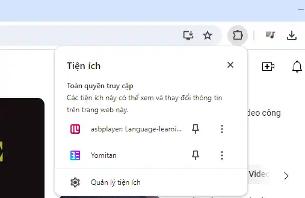
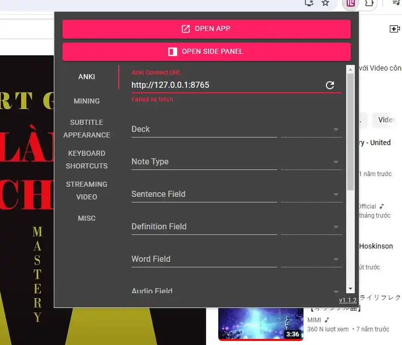
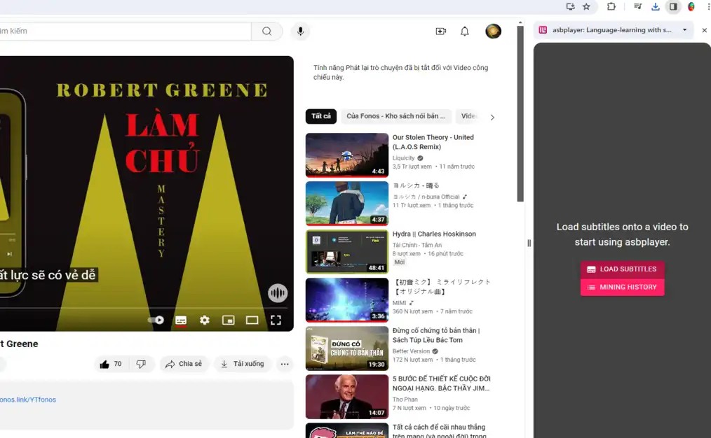
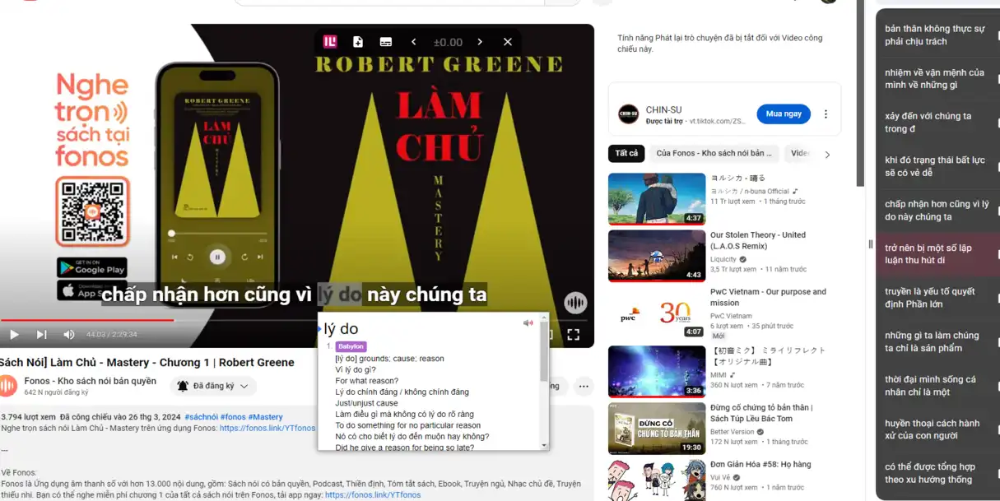
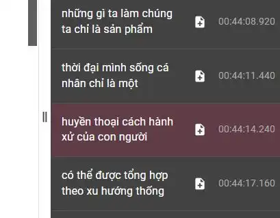
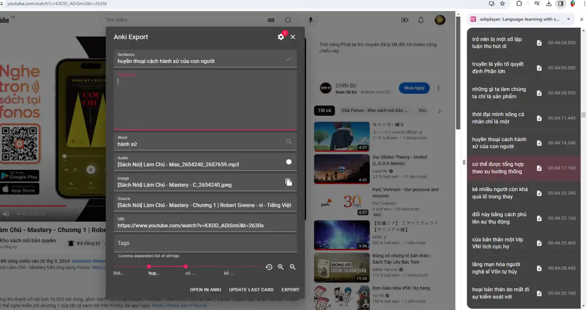

## Mining Vietnamese sentences using Asbplayer

You have to install Asbplayer Browser Extension on your Browser (Chrome or Chrome/Chromium-based only, it doesn't support Firefox). You can download it [here](https://chromewebstore.google.com/detail/asbplayer-language-learni/hkledmpjpaehamkiehglnbelcpdflcab)

First, open the Extension by clicking on the "asbplayer" inside the Extension list here.

Choose "Open Side Panel" to show the Side Panel (On the right side of the Browser).

Click "Load Subtitles".

It will ask you to choose the subtitle(s), most of the Vietnamese videos have auto-generated subtitles, you can choose that (It's pretty accurate tbh). 

Now you can look up words right inside Youtube 

You can also create Anki cards for any sentences or words too!

Here is how it looks like after you "added" a sentence.

