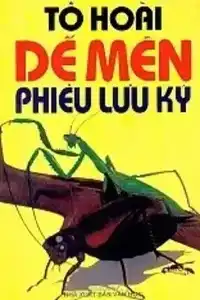
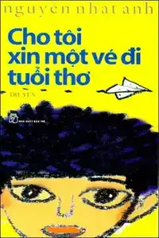
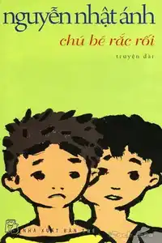
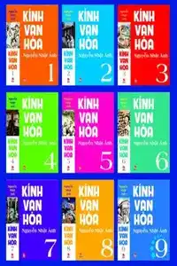
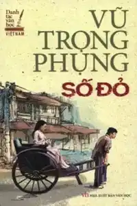
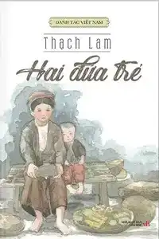
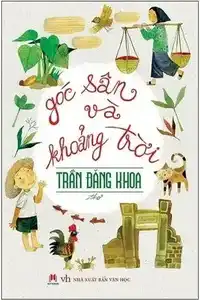

I have no idea how should I sort these books, so here is the approximate difficulty, based on my own reading experiences. 

You should read these Vietnamese books using an [online ebook reader](https://reader.ttsu.app) (to look up words immediately using Yomitan. Learn more about how to read and look up words in Vietnamese [here]()) or using ebook reader like Kindle or Kobo. 

| Name | Author | Difficulty | Description | Book cover |
| --- | --- | --- | --- | --- |
| Dế mèn phiêu lưu kí | Tô Hoài | Easy | This book is written for children, but still enjoyable to read. |  |
| Cho tôi xin một vé về tuổi thơ | Nguyễn Nhật Ánh | Easy-Medium | Written in a child's perspective | |
| Chú bé rắc rối | Nguyễn Nhật Ánh | Easy-Medium | Written in a child's perspective too |  |
| Bảy bước tới mùa hè | Nguyễn Nhật Ánh |Easy-Medium | Most of the books written by this author is easy to read, simple vocabulary. |  |
| Kính vạn hoa | Nguyễn Nhật Ánh | Medium | Collection of 54 stories |  |
| Số đỏ | Vũ Trọng Phung | Medium-Hard | Well-written, kinda hard to fully understand the book (the plot). One of the top works from "Vũ Trọng Phụng" |  |
| Hai đứa trẻ | Thạch Lam | Unknown | |  |
| Góc sân và khoảng trời | Trần Đăng Khoa | Unknown | | |
