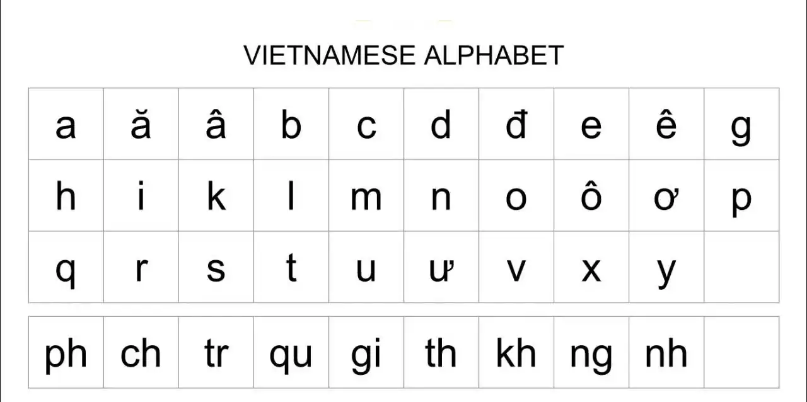
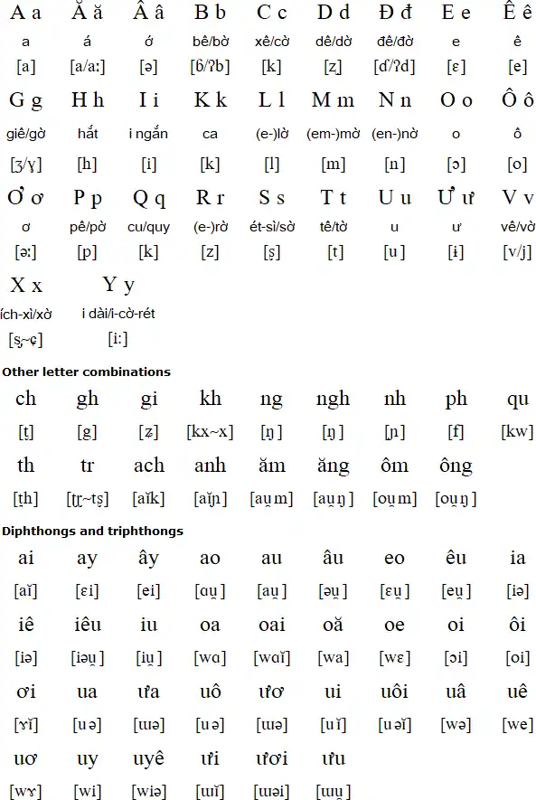
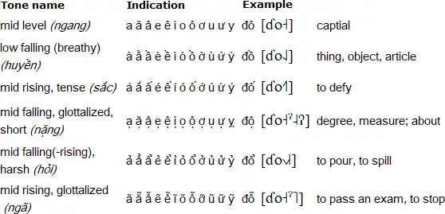

The structure of this guide is based on [TheMoeWay's Guide](https://learnjapanese.moe/guide/) (TheMoeWay's guide includes the "Preface" part, which tackles many questions about traditional language learning methods so feel free to check this out). 

Vietnamese has:

- No conjugation you would need to remember.
- Lots of loan words from Chinese (if you know some Chinese, you have something to associate your new vocabulary with).
- The script: Latin-based.

## 1.1 How to learn Vietnamese

You might wanna watch [this video](https://www.youtube.com/watch?v=GRPnQe2FTrY) and [this video](https://youtu.be/y1fF69jiavU?si=3f2CvFzjN-8zxPNP) before reading this whole learning guide.

### Beginner study process

The learning process for the beginner consists of:

- Learning the alphabet (29 letters) and tones (6 tones).  

- Learning basic vocabulary with a program called _Anki_

- Learning grammar through a _YouTube_ playlist or a full-text guide.

- Starting immersion with easy content and with high repetition. This is how you will be spending most of your time.

## 1.2 Vietnamese alphabet

The Vietnamese alphabet, also known as the Quốc ngữ script, stands as the official writing system of Vietnam, reflecting the linguistic and cultural heritage of the country. This unique script, unlike many other East Asian writing systems, is based on the Latin alphabet, showcasing the influence of Western linguistic traditions in Vietnam’s language development. The alphabet consists of 29 letters, including 14 consonants and 15 vowels. Each letter has a unique sound, and it is essential to know how to pronounce them correctly in order to speak and read Vietnamese fluently. 

### 1.3 How to learn the alphabet

### Step 1: the chart

_The alphabet chart, there are some characters that sound different than the English counterpart, don't try to remember all of them at first, especially the letter combinations._

_The tone chart._

There are six (6) tones in the Vietnamese language with five (5) tone marks as you can see in the above chart.

Both of the above chart are taken from [Omniglot](https://www.omniglot.com/writing/vietnamese.htm).

You might wanna use the chart as a master reference for all singular characters and letter combinations. This will help you a lot when you are learning how to read Vietnamese so I recommend you save it. 

#### Step 2 - The YouTube video

- Learn Vietnamese alphabet pronunciation [here](https://youtu.be/Jf6mvBy9VXk?si=u35CESIcmtEIZYas).

- After that, learn Vietnamese tones [here](https://www.youtube.com/watch?v=3bptcM1hf1E).

Both videos only take you 20 minutes, so don't skip any parts and watch until the end. 

#### Step 3 - the grinding

You can use [this Anki deck](https://ankiweb.net/shared/info/2093025241) (check the Anki guide below before downloading this deck and use it) to revise the alphabet (I assume you've finished Step 2). Or, if you want an easier way to test yourself, [here is the Quizlet link](https://quizlet.com/vn/888929191/vietnamese-alphabet-flash-cards/) for the Vietnamese alphabet.

#### Step 4 - reading practice

What also helps immensely in memorising the alphabet and the tones is reading Vietnamese sentences. You don't have to understand the meaning yet, just read to remember them for now (don't speak it aloud, it goes against the immersion rule, or reading too much, it may affects your Vietnamese pronunciation).

I recommend practising by trying to read some storybooks, which you can find [here](https://global-asp.github.io/storybooks-sah/stories/vi/).

#### Step 5 - "học đánh vần" - Pronunciation

Learning how to read Vietnamese words is non-trivial at first but it pays off in the long run. You don't have to rely on IPA, frankly you shouldn't because the IPA for most Vietnamese words looks intimidating. Furthermore, The Vietnamese script is almost entirely phonetic, meaning you can read a new word and know how to pronounce it immediately.

You should read [this guide](https://morevietnamese.com/pronounce-vietnamese-words/) written by [Elisabeth Ruth](https://morevietnamese.com/). 

You should also have a pronunciation deck, please visit [here](https://ankiweb.net/shared/info/1747674390) to download the deck.

## 1.4 Learning Vocabulary
 
To make Vietnamese less daunting, I recommend you work through a beginner-level vocabulary deck for Anki. This is a deck consisting of around 1000 to 2000 words aimed at teaching you the most common Vietnamese words to jumpstart your Vietnamese learning.

Please visit [here](https://daihocmo.github.io/learn-vietnamese/anki/#premade-decks-for-vietnamese-learning) to download some of the suggested Vietnamese Vocabulary Decks.

### Quick Anki Setup

Anki is a flashcard program designed to help you remember large amounts of information, such as vocabulary.

Visit the [Anki download page](https://apps.ankiweb.net/), and download the version of Anki for your system and install it.

Download the one for your system.

When opening Anki for the first time, you will be asked to set your display language, just leave it at the default (English).

Wanna use premade decks instead of making your own deck? Visit [here](./anki.md).

After the download is complete, import the deck by clicking "Import file" and navigating to the downloaded file (.apkg) and then click Import on the top right.

### Quick Anki Usage Guide

Before studying, I recommend changing some settings first. Click the cog icon next to the deck, and go on _Options_.

Change the _Maximum reviews/day_ from `200` to `9999`. Don't be alarmed by this number, your reviews probably won't ever reach that high, it's just uncapping your daily review limit for the optimal experience.

As for _New cards/day_, I think `20` might be too big of a commitment for some. If you aren't feeling confident learning 20 new words per day, try dropping the number down to `10` or lower.

You can delete any card by going in "More" and clicking "Delete Note"

Anki helps you remember things by testing your knowledge of what is on the back of the card. What you are being tested for here is whether you know the meaning and how to read the word. Everything else on the card is only there for aid.  

When seeing an unfamiliar Anki card for the first time, the general rule of thumb is to click _Show Answer_ so you can see what's on the back of the card.

The pieces of information you need to memorise.

Once you have had a good look, press _Again_ (this is short for try again). You will be on the next card, do the same thing as it is also a card you are seeing for the first time.  
The next time you see the card, it is knowledge testing time. Try your best to remember the meaning and reading that was on the back of the card and grade yourself!

This, in essence, is how we are going to learn vocabulary in the beginner stage.

Once you have completed your new cards for the day, make sure you come back the next day to check your reviews!

## 1.5 Grammar

Learning grammar can be straightforward and complex at the same time. It's quite essential to learning Vietnamese and while it might seem daunting at first, there are resources out there that help make the learning process easier. The grammar learning process is relatively simple; just pick up a guide and read/watch it.

Here are a few guides I wanna recommend to total beginners. You do not need to do every single one, just find the one that works well for you.

- Elementary Vietnamese by Binh Nhu Ngo
- [Learning Vietnamese Grammar with TVO](https://www.youtube.com/playlist?list=PLpDgPu_Hq9ZxWC8CAODefCnjAov6t-3ev): A grammar series in Northern dialect made by Tieng Viet Oi, despite being a Vietnamese learning channel there are many videos made for native speakers like podcasts.
- [seahorse viet grammar's archive](https://seahorseviet.wordpress.com/category/grammar/): Many grammar points but without sorting.

It is prime time to start getting some immersion going when you have learned some new grammar points. Seeing how the grammar you learned is applied in real usages really helps further your understanding of the grammar points.

## 1.6 Beginner immersion: an uphill battle

Comprehensible Input is input that is understandable at your level, where there’s just a few missing pieces of the puzzle every few sentences. With this sort of immersion, you subconsciously fill in the incomprehensible parts with educated guesses based on context, which is what makes this type of input so useful for the purposes of language learning.

Now you may have noticed a problem here. What do you do if you don’t have access to comprehensible input? As a complete beginner, there is no content that is easy. In fact, this is why people often fall into the endless cycle of reading from beginner resource to beginner resource. Though incomprehensible input is by no means useless—it does have its benefits and assists with learning—it is very difficult to get past that initial hurdle.

Failing to understand the content you want to enjoy inherently sucks unless you take a specific mindset to it—taking pleasure in the knowledge that you are making gradual progress, even if that progress is immediately imperceptible. However, it’s difficult to maintain this mindset all the time, so it isn’t reliable as the sole motivator for consistency—the number one key of mastering any skill!

So how can we make it so we don’t constantly dread having to parse through content that is difficult to understand?

The answer is actually very simple. Fun! Media can be entertaining for reasons other than language content. By choosing media that also has high entertainment value regardless of its language level, we are able to stay consistently engaged and motivated to continue our immersion. Then, as our language experience grows, we naturally find ourselves understanding more and more, and the once seemingly unattainable goal of finding comprehensible input has now become a given, with the goal rather shifting to finding content that is difficult enough to push us to continue learning.

## 1.7 How to immerse

### Reading & Dictionaries

To make Vietnamese less of a pain to read, you can use a free browser extension known as Yomitan. You can find a tutorial on how to use it [here](https://learnjapanese.moe/yomichan/). 

To look up words individually, you can use [Soha](http://tratu.soha.vn/) (Remember to change dictionary mode to "Việt - Anh", the dropdown box), apps for Android [here](https://play.google.com/store/apps/details?id=com.bravolang.dictionary.vietnamese&hl=en&gl=US).

### Choosing immersion content

Honestly, pick whatever you want. If you don't have anything in mind you can just check [Vietnamese Media Recommendation](media.md). Just make sure you're actually interested in whatever you're choosing to immerse with!

### How to immerse with listening

Listening is almost entirely a top-down, "intuitive" approach. We don't want to think too hard over things when we are listening. Go with the flow until you find a really good oppportunity to pause and look something up.  

There are certain levels to listening. Level one would be free-flow listening, where you let the listening flow without looking things up. Level two would be looking things up that pop out at you but still letting the listening play. Level three would be pausing at every single unknown word and looking them up.  

In the beginner to intermediate stages, listening is entirely level one and level two listening. Don't think too hard about it and cherish all the little opportunities you get.

#### "Active" and "Passive" listening

Active listening is when you are paying full attention to your listening. You are engaging with all aspects of it like looking at the screen and listening to the anime. This is the type of listening where you are making the most gains.

Passive listening is where you do something else and have the listening on in the background. This helps when you intermittently listen in on your listening for brief moments, it can hugely benefit you if you have a busy lifestyle. I actually recommend doing passive immersion to fill in the gaps where you're usually not doing Vietnamese.

### How to immerse with reading

In contrast to listening, reading is sort of a bottom-up, take-your-time, "analytical" approach. You can take as much time as you'd like reading sentences and looking up words. The process loop is essentially **read → look up word → reaction → read more → look up word → (repeat)**. For a while, it is going to seem like banging your head against a wall, but this is really just how you're going to build up reading ability.  
Reading content with a visual component such as Youtube videos, Manga can help ease you into reading.

### Ideal ratio between listening and reading

In the beginner stage I recommend a 7:3 listening to reading ratio. This is mainly because listening is the most natural form of the language, so I believe it is essential to prioritise it to make your brain process Vietnamese more naturally.  

You can start to lower the amount of listening to an equal 5:5 ratio when you get better at Vietnamese.

## 1.8 Beginner learning loop

### The wrong way to do it

> The wrong way

_Learn the alphabet, then learn ALL the 1500 words in the Core deck, then learn ALL the grammar before you finally try immersion for the first time..._

This is a terrible approach. You need to do a bit of everything.

### The right way to do it

While you are learning the alphabet, I suggest you get into the immersion spirit by trying to watch something in Vietnamese without subtitles. It can be anything you like, and you don't need to understand anything.

After that you should learn vocabulary and grammar at the same time. How about doing 10 new words and learn 2 grammar points per day? And in the same day, try to get some immersion in.

> "How long should I do immersion per day?"

I recommend around 1 hour to 2 hours when starting out. There is no harm in doing more immersion than that, and you will improve faster with more immersion per day.  

## 2.1 Regarding speaking and writing (output)

People often have the misconception that speaking the language a lot is how you get better at the language, but this isn't really the case, as the input we receive from hearing and seeing natives use their language is what actually benefits us. While output won't directly improve your proficiency at the language, it is still quite important to be practicing output, whether it is by texting or with speech, because input and output go hand in hand. Doing output effectively forces your brain to make sure it is correctly understanding the words you are hearing and you may start to subconsciously look for opportunities to use what you hear in input.  
Regular output along with regular input is recommended.

Contrary to what many immersion-based learning methods say, I do not believe it is a smart idea to delay your output until you are "really good" for reasons such as "saying things incorrectly is going to "cripple" or "ruin" your Vietnamese". Doing this makes you miss out on so many opportunities to pick up on things to use in your output earlier and brainwashes you into a toxic perfectionist mindset, becoming extremely protective of your Vietnamese.

## 2.2 Learning milestones

For those that are curious, here is the level of Vietnamese ability you can expect to have after reaching these milestones.

- 50 active immersion hours: You are really starting to get the hang of listening to Vietnamese. You are probably able to understand a good chunk of sentences now.
- 150 active immersion hours: At this point listening to Vietnamese is going to feel more natural than ever before.
- 300 active immersion hours: If you have been keeping up with your study... then I can't really consider you a beginner anymore at this point. There's going to be a huge difference between your abilty now compared to when you were starting out!
- 1 full novel finished: While you had a really rough time trying to understand this book, you are beginning to really shoot out of the beginner stage. The next book you read will be noticeably easier.
- 5 novels finished: I wouldn't consider you are a beginner anymore. You are really beginning to build up good Vietnamese reading proficiency.
- 10 novels finished: Completely intermediate at this point. Congratulations!

## 2.3 Closing notes: post-beginner stage and beyond

_This guide is made possible by TheMoeWay community, I just modified it so it fits Vietnamese learners better. All thanks and donation should goes to them, not me._

There isn't really much else to the learning process other than immerse a lot and learn words and grammar. You can really get fluent at Vietnamese with this method. But one thing does change when you leave the beginner stage.

Learning vocabulary with Anki will become much more personal as you will be making your own cards from words found in your immersion in a process we call _mining_. You can search "Sentence Mining" for further information. Mining will essentially become the heart of your language _study_. 

Here are some guides for "Sentence Mining", in order:

- [Basic Sentence Mining Guide from Refold](https://refold.la/roadmap/stage-2/a/basic-sentence-mining)
- [How to use Sentence Mining](https://www.reddit.com/r/languagelearning/comments/ja37ua/how_do_i_use_sentence_mining/)

Thank you so much for taking your time to read this guide and I wish you good luck on your Vietnamese learning journey!
