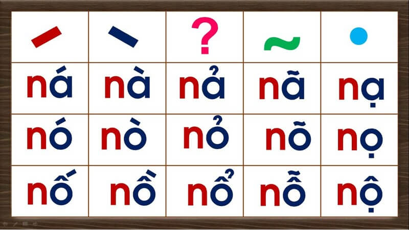

# Vietnamese Guide

*If you don't need a preface, please skip to [2.1 How to learn Vietnamese](#21-how-to-learn-vietnamese)*  

## 1.1 Why many people "fail" to learn Vietnamese
  
Many people have simple goals in mind when learning Vietnamese: to speak Vietnamese fluently or enjoy Vietnamese media (kinda rare). 

You'll hear everyone say something along those lines when asked about their learning goals. However, many also fail to reach these goals even after years of study. Is the language just too hard? Are they just not studying hard enough?
  
I believe it's actually not their fault, but rather the method's. In language learning, the method behind your learning makes a huge difference in the kind of progress you make.

As it turns out, reaching such goals is not possible with "traditional" methods of Vietnamese learning. Many students are led to failure for not including a crucial ingredient, **immersion**, into their study routines. **Immersion** refers to listening to or reading native content made for native speakers.

## 1.2 Problems with traditional methods

{:  style="display: block; margin: 0 auto; max-width:40%; height:auto;" }  

A Vietnamese learner following a “traditional” study method would usually go through the following steps:

- Learning the alphabet(s).
- Learning basic sentences such as greetings and self-introductions.
- Learning basic grammar structure and vocabulary.
- Coming up with sentences either by having conversations with a tutor or study partner, or by writing.
- Translating example sentences from their native language to their target language and vice versa.
- Looking up further material about grammar structures and vocabulary in textbooks or YouTube videos recommended by a tutor.
- Practising conversation using knowledge from their study.
- Accumulating more vocabulary and grammar structures, which becomes a measure of one’s own progress
- And finally, in the endgame, moving to or visiting Vietnam in hopes of having opportunities to practise their skills.

None of that is bad in itself, it is actually sufficient study, but it's not enough to get you to a high level of proficiency. The problem is they aren't actually engaging with the real language—but what do I mean by that?

Let's take swimming as an example. You can't just stay in the baby pool with floaters and take your time to become a pro at the baby pool before attempting to swim in a real pool. This won’t make you a good swimmer. You also can't expect to become a good swimmer just by learning the theory behind the techniques in isolation and practising them without actually swimming in a real pool.

How about a more relatable example: competitive video games. You won’t get better at the game just playing against the AI and grinding in training mode all day. You have to play the real game against other people even if you think you’re going to lose by a landslide. This is "playing the real game", with no strings attached.  

  It's important to learn how to move on!

A common trap students fall into in language learning is staying on beginner resources for too long.  

They want to ensure they know every single detail of their basics and refuse to move on to the real language. They refuse to engage in anything they aren't already comfortable with, because they're too afraid of not understanding anything. They may feel like they aren't “ready". Yet it’s important to leave your beginner resources as soon as possible because, in reality, you will never be ready until you actually start engaging with the real language and get yourself used to it.  

Perfectionism can be a double-edged sword in language learning. As a perfectionist myself, I've suffered more than I've gained wanting to make sure I've gotten every single detail down of trivial things that didn't really matter in the big picture.  

Learning a language is like climbing a mountain. You can try to climb that mountain without anything assisting your ascent, and though it will take lots of struggle, you will eventually make it if you persist. Traditional study is like building a rope so that it's easier to climb that mountain, but you can't climb the mountain just by making a rope! You eventually have to climb it, because no matter how much rope you decide to make climbing that mountain is still going to be difficult and time-consuming.

## 1.3 The scale of language

Language is… huge. There's so much to it that far exceeds the limitations of a classroom or app-based approach that tries to teach in an "x means y" or "x does y" format. Mastering a language to a higher level requires enormous amounts of experience reading and listening to what native speakers say.

It's often difficult to grasp why they tend to use *that* phrase in *this* context, or *this* word instead of *that* other one… This creates a barrier for us learners as we can't just study grammar and vocabulary to achieve native-like fluency.

Without the prerequisite experience, attempting to construct sentences in your target language often leads to unnatural, or difficult to understand phrasing. In turn, lack of experience with how native speakers use their language makes it difficult to understand them, due to unfamiliarity with phrasing outside of a learning resource's scope.

This is why in your learning routine, **you do what we call "immersion"—read and listen to what natives write and speak.**

Language learning is a process of subconsciously memorising patterns with comprehensible input. What this means is, when you understand something (comprehensible) in your immersion (input), your brain subconsciously stores that pattern for later information retrieval. You see, being able to comfortably read this guide is only possible because you have so much experience reading English in the past that, when you read this, your brain thinks something like, "Oh, there's pattern #234 used with pattern #82 and pattern #10!".    

And since you are a proficient English reader, this is done effortlessly. You can understand the words in these sentences. You can understand what links the sentences together. You can even detect the tone and degree of formality in my writing, and it's all thanks to your brain storing the context, and other information of all the language patterns that you've come across.

Notice how I haven't mentioned "knowing the grammar" or "having memorised the vocabulary"? This is because you don't organically process language in this manner. Some readers may not even be native speakers and probably have studied English grammar before, but it is unlikely they're actively thinking about it when coming into contact with English every day.

## 1.4 Coming to terms with sucking

{:  style="display: block; margin: 0 auto; max-width:40%; height:auto;" }  

In language learning, and in anything that requires skill, you are always going to start off struggling for a long time until you get better. As mentioned earlier, many learners (I am guilty of this too) fall into the trap of attempting to master something before ever trying to engage in practice with what they need to work on.  

For example, a student might fuss over a certain aspect of grammar for way too long and never find the time to move on to something else they are better off spending their time with.

<h3>↑ This here is what we want to avoid.</h3 >  

We have to get into the habit of letting go and start doing what we actually need to do. 

Yes, you won't understand that book or movie perfectly the first time, but that’s not how learning works. It always takes a third, fourth, fifth and even sixth attempt to finally learn something.

## 1.5 What even is "immersion"?

Immersion is when you interact with natural content in the target language. This means, content that is NOT made for or cherry picked for learners. Content that a native speaker of the language would also consume.  

If you were an English learner, reading this guide right now would be "doing your English immersion", because this guide is not watered down or aimed at English learners. It is written for a native/proficient English speaking audience.  

Thus, when you listen to, or read Vietnamese content that a Vietnamese person would also normally consume, you are doing immersion.  

Technically, we would refer to this as *input*, but I like the term *immersion* more. 

## 1.6 A top-down approach to learning

Learning a language requires you to be content with not understanding everything.  

It is drastically different from conventional ways of learning experienced at school where perfectionism is rewarded and you are graded according to an arbitrary criteria or through exams.  

Usually, what happens when language learners try to interact with the real language, whether it is a TV series in that language, or a book, or even just having a normal conversation with natives, is they tend to get discouraged extremely quickly due to not understanding everything, or much at all. After all, it can seem counter-intuitive to keep going at it when you understand so little, but as explained earlier, learning a language is like jumping in the deep end.  

What sets language learning apart from school-like subjects is it's too based on real-world and natural use that cannot conceivably be covered by study material.  

So, the only way you are going to get used to everything is by coming to terms with having low comprehension, because the more we interact with the language, the more we improve.  

Of course, you will not be *only* doing immersion with no aid at all. You will study things like grammar and starter vocabulary on the side, and use dictionaries to learn the words from your immersion.  

## 2.1 How to learn Vietnamese

### Beginner study process

The learning process for the beginner consists of:

- Learning the alphabet (29 letters) and tones (6 tones).  
- Learning basic vocabulary with a program called _Anki_
- Learning grammar through a _YouTube_ playlist or a full-text guide.
- Starting immersion with easy content and with high repetition. This is how you will be spending most of your time.

## 2.2 Vietnamese writing system

The Vietnamese alphabet, also known as the Quốc ngữ script, stands as the official writing system of Vietnam. This unique script, unlike many other East Asian writing systems, is based on the Latin alphabet.

_The tone chart._

Vietnamese is a tonal language (i.e., with accent marks/diacritics) with some vowels that don’t appear in the English alphabet (e.g. ă, ơ, ê). There are six (6) tones in the Vietnamese language with five (5) tone marks as you can see in the above chart. Here is a simple guide to get started:

- Learn Vietnamese alphabet pronunciation by watching [this video](https://www.youtube.com/watch?v=vywmh8V_5h0).
- After that, learn Vietnamese tones [here](https://www.youtube.com/watch?v=EnpL-Hhiy4E), don't try to pronouce it, just remember and then listen to a lot of Vietnamese, you'll gradually become good at it.

You can use [this Anki deck](https://ankiweb.net/shared/info/2093025241) (check the Anki guide below before downloading this deck and use it) to revise the alphabet (I assume you've finished Step 2). Or, if you want an easier way to test yourself, [here is the Quizlet link](https://quizlet.com/vn/888929191/vietnamese-alphabet-flash-cards/) for the Vietnamese alphabet.

What also helps immensely in memorising the alphabet and the tones is reading Vietnamese sentences. You don't have to understand the meaning yet, just read to remember them for now. I recommend practising by trying to read some simple storybooks, which you can find [here](https://global-asp.github.io/storybooks-sah/stories/vi/).

Learning how to read Vietnamese words is non-trivial at first but it pays off in the long run. You don't have to rely on IPA, frankly you shouldn't because the IPA for most Vietnamese words looks intimidating. Furthermore, The Vietnamese script is almost entirely phonetic, meaning you can read a new word and know how to pronounce it immediately. Getting started by reading [this guide](https://morevietnamese.com/pronounce-vietnamese-words/) written by [Elisabeth Ruth](https://morevietnamese.com/). You should also have a pronunciation deck, please visit [here](https://ankiweb.net/shared/info/1747674390) to download the deck.

## 2.3 Vocabulary

I recommend you work through a beginner-level vocabulary deck for Anki. This is a deck consisting of around *1000* words aimed at teaching you the most common Vietnamese words to jumpstart your Vietnamese learning.  

[Anki](https://apps.ankiweb.net/) is a flashcard program that helps you acquire vocabulary through [spaced repetition](https://www.antimoon.com/how/srs.htm). It is commonly used in conjunction with the [Basic Vietnamese for English Speakers](https://ankiweb.net/shared/info/285983903) vocabulary deck by beginners to build up a basic vocabulary of common words in preparation for immersing.

After completing the core deck, you should start to build your *mining deck*. A **mining deck** is a vocabulary deck which you build up yourself with the unknown words that you encounter while immersing. The browser add-on [Yomitan](https://yomitan.wiki/) simplifies this process to a single click, so that all you need to do to add a card to your deck is hover over a word and click the + button in the popup.

## 2.4 Grammar

Learning grammar can be straightforward and complex at the same time. It's quite essential to learning Vietnamese and while it might seem daunting at first, 
there are resources out there that help make the learning process easier. The grammar learning process is relatively simple; just pick up a guide and read/watch it.    

There have been many resources throughout the years that teach grammar, many great and many not so great. Due to the nature of the topic, just one grammar resource may not be enough for everyone.

Here are a few guides I wanna recommend to total beginners. You do not need to do every single one, just find the one that works well for you.

- [seahorse viet grammar's archive](https://seahorseviet.wordpress.com/category/grammar/): Many grammar points but without sorting.
- [Vietnamese: An Essential Grammar](https://www.amazon.com/Vietnamese-Essential-Grammar-Routledge-Grammars/dp/1138210706)
- [Learning Vietnamese Grammar with TVO](https://www.youtube.com/playlist?list=PLpDgPu_Hq9ZxWC8CAODefCnjAov6t-3ev)

It is prime time to start getting some immersion going when you have learned some new grammar points. Seeing how the grammar you learned is applied in real usages really helps further your understanding of the grammar points.   

## 2.5 Beginner immersion: an uphill battle

Comprehensible Input is input that is understandable at your level, where there’s just a few missing pieces of the puzzle every few sentences. With this sort of immersion, you subconsciously fill in the incomprehensible parts with educated guesses based on context, which is what makes this type of input so useful for the purposes of language learning.

Now you may have noticed a problem here. What do you do if you don’t have access to comprehensible input? As a complete beginner, there is no content that is easy. In fact, this is why people often fall into the endless cycle of reading from beginner resource to beginner resource. Though incomprehensible input is by no means useless—it does have its benefits and assists with learning—it is very difficult to get past that initial hurdle.

Failing to understand the content you want to enjoy inherently sucks unless you take a specific mindset to it—taking pleasure in the knowledge that you are making gradual progress, even if that progress is immediately imperceptible. However, it’s difficult to maintain this mindset all the time, so it isn’t reliable as the sole motivator for consistency—the number one key of mastering any skill!

So how can we make it so we don’t constantly dread having to parse through content that is difficult to understand?

The answer is actually very simple. Fun! Media can be entertaining for reasons other than language content. By choosing media that also has high entertainment value regardless of its language level, we are able to stay consistently engaged and motivated to continue our immersion. Then, as our language experience grows, we naturally find ourselves understanding more and more, and the once seemingly unattainable goal of finding comprehensible input has now become a given, with the goal rather shifting to finding content that is difficult enough to push us to continue learning.

## 2.6 How to immerse

### Reading & Dictionaries

To make Vietnamese less of a pain to read, you can use a free browser extension known as Yomitan. You can find a tutorial on how to use it [here](https://learnVietnamese.moe/yomichan/). 

To look up words individually, you can use [Lạc Việt](https://tratu.coviet.vn/hoc-tieng-anh/tu-dien/lac-viet/V-A/-all.html), apps for Android [here](https://play.google.com/store/apps/details?id=com.bravolang.dictionary.vietnamese&hl=en&gl=US).

### Choosing immersion content

Honestly, pick whatever you want. If you don't have anything in mind you can just check [Vietnamese Media Recommendation](https://onlyduyy.github.io/vietnamese-media-recommendation/). Just make sure you're actually interested in whatever you're choosing to immerse with!

### How to immerse with listening

Listening is almost entirely a top-down, "intuitive" approach. We don't want to think too hard over things when we are listening. Go with the flow until you find a really good oppportunity to pause and look something up.  

There are certain levels to listening. Level one would be free-flow listening, where you let the listening flow without looking things up. Level two would be looking things up that pop out at you but still letting the listening play. Level three would be pausing at every single unknown word and looking them up.  

In the beginner to intermediate stages, listening is entirely level one and level two listening. Don't think too hard about it and cherish all the little opportunities you get.

#### "Active" and "Passive" listening

Active listening is when you are paying full attention to your listening. You are engaging with all aspects of it like looking at the screen and listening to the audio/podcast. This is the type of listening where you are making the most gains.

Passive listening is where you do something else and have the listening on in the background. This helps when you intermittently listen in on your listening for brief moments, it can hugely benefit you if you have a busy lifestyle. I actually recommend doing passive immersion to fill in the gaps where you're usually not doing Vietnamese.

### How to immerse with reading

In contrast to listening, reading is sort of a bottom-up, take-your-time, "analytical" approach. You can take as much time as you'd like reading sentences and looking up words. The process loop is essentially **read → look up word → reaction → read more → look up word → (repeat)**. For a while, it is going to seem like banging your head against a wall, but this is really just how you're going to build up reading ability.  
Reading content with a visual component such as Youtube videos can help ease you into reading.

### Ideal ratio between listening and reading

In the beginner stage I recommend a 7:3 listening to reading ratio. This is mainly because listening is the most natural form of the language, so I believe it is essential to prioritise it to make your brain process Vietnamese more naturally.  

You can start to lower the amount of listening to an equal 5:5 ratio when you get better at Vietnamese.

## 2.7 Beginner learning loop

### The wrong way to do it

!!! failure "The wrong way"
    Learn the alphabet, then learn ALL the 1500 words in the Core deck, then learn ALL the grammar before you finally try immersion for the first time...

This is a terrible approach. You need to do a bit of everything.

### The right way to do it

While you are learning the alphabet, I suggest you get into the immersion spirit by trying to watch something in Vietnamese without subtitles. It can be anything you like, and you don't need to understand anything.

After that you should learn vocabulary and grammar at the same time. How about doing 10 new words and learn 2 grammar points per day? And in the same day, try to get some immersion in.

!!! question "How long should I do immersion per day?"
    I recommend around 1 hour to 2 hours when starting out. There is no harm in doing more immersion than that, and you will improve faster with more immersion per day.  

## 3.1 Regarding speaking and writing (output)

People often have the misconception that speaking the language a lot is how you get better at the language, but this isn't really the case, as the input we receive from hearing and seeing natives use their language is what actually benefits us. While output won't directly improve your proficiency at the language, it is still quite important to be practicing output, whether it is by texting or with speech, because input and output go hand in hand. Doing output effectively forces your brain to make sure it is correctly understanding the words you are hearing and you may start to subconsciously look for opportunities to use what you hear in input.  
Regular output along with regular input is recommended.

Contrary to what many immersion-based learning methods say, I do not believe it is a smart idea to delay your output until you are "really good" for reasons such as "saying things incorrectly is going to "cripple" or "ruin" your Vietnamese". Doing this makes you miss out on so many opportunities to pick up on things to use in your output earlier and brainwashes you into a toxic perfectionist mindset, becoming extremely protective of your Vietnamese.

## 3.2 Learning milestones

For those that are curious, here is the level of Vietnamese ability you can expect to have after reaching these milestones.

- 50 active immersion hours: You are really starting to get the hang of listening to Vietnamese. You are probably able to understand a good chunk of sentences now.
- 150 active immersion hours: At this point listening to Vietnamese is going to feel more natural than ever before.
- 300 active immersion hours: If you have been keeping up with your study... then I can't really consider you a beginner anymore at this point. There's going to be a huge difference between your abilty now compared to when you were starting out!
- 1 full novel finished: While you had a really rough time trying to understand this book, you are beginning to really shoot out of the beginner stage. The next book you read will be noticeably easier.
- 5 novels finished: I wouldn't consider you are a beginner anymore. You are really beginning to build up good Vietnamese reading proficiency.
- 10 novels finished: Completely intermediate at this point. Congratulations!

## 3.3 Closing notes: post-beginner stage and beyond

### TL;DR

1.  Learn and remember the Vietnamese alphabet, tones and how to read Vietnamese.
2.  [Basic Vietnamese for English Speakers](https://ankiweb.net/shared/info/285983903) is the generally recommended Anki deck for beginners who want to build up a basic vocabulary before they start reading. You should install [Yomitan](https://yomitan.wiki/) (Firefox/Chrome), which will allow you to look up words by hovering over them.
3.  Since you will probably be learning vocabulary alongside grammar, it is important that you pace yourself. This does not mean that you should not push yourself though. You can change the amount of new cards a day in Anki, but leave it at the default amount for the first few days and see how it suits you. Raise the amount of cards if you feel like you have headroom, and lower it if you feel overwhelmed (or just push yourself harder). Once you get into the swing of things, your total cards to review will be around ten times the amount of your new cards per day (so 20 new cards per day would mean about 200 reviews per day). You should set the upper limit for daily reviews in the deck options to the highest number possible, because failing to do all of your reviews on schedule will interfere with Anki's spaced-repetition-system. If you have trouble keeping up, lower the amount of new cards instead of limiting your reviews.
4.  To learn grammar, [seahorse viet grammar's archive](https://seahorseviet.wordpress.com/category/grammar/) is generally recommended.
5.  Once you have read through your chosen grammar guide, you are ready to start immersing yourself in Vietnamese. While it's not necessary, reading will be easier if you have learner around 1000->2000 words.
6.  Start a mining deck. A mining deck is a vocabulary deck to which you add unfamiliar words that you encounter while immersing.
7.  Listen more. Read more. Reading will be slow in the beginning, but the more you practice the better you will get at it.
8.  Regular output (speaking, writing) along with regular input (listening, reading) is recommended. 
9.  Enjoy compelling content.

### Closing notes

There isn't really much else to the learning process other than immerse a lot and learn words and grammar. You can really get fluent at Vietnamese with this method. But one thing does change when you leave the beginner stage.

Learning vocabulary with Anki will become much more personal as you will be making your own cards from words found in your immersion in a process we call _mining_. You can search "Sentence Mining" for further information. Mining will essentially become the heart of your language _study_. 

Thank you so much for taking your time to read this guide and I wish you good luck on your Vietnamese learning journey!

