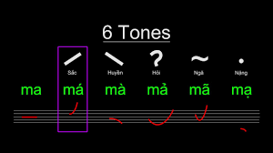

# Vietnamese Guide

Traveling to Vietnam to talk with Vietnamese natives, watching Vietnamese movies, reading novels all require the same fundamental skills and knowledge. While this guide is not going to be enough to teach you these skills, it will give you an idea of how to go about acquiring them.

This guide only aims to introduce you to the Vietnamese language and show you how to get started. The rest is up to you.
 
The learning process for the beginner consists of:

- Learning the alphabet (29 letters) and tones (6 tones).  
- Learning basic vocabulary with a program called _Anki_
- Learning grammar through a _YouTube_ playlist or a full-text guide.
- Starting immersion with easy content and with high repetition. This is how you will be spending most of your time.

## Learning Vietnamese

### Vietnamese writing system

The Vietnamese alphabet, also known as the Quốc ngữ script, stands as the official writing system of Vietnam. This unique script, unlike many other East Asian writing systems, is based on the Latin alphabet.

_The tone chart._

Vietnamese is a tonal language (i.e., with accent marks/diacritics) with some vowels that don’t appear in the English alphabet (e.g. ă, ơ, ê). There are six (6) tones in the Vietnamese language with five (5) tone marks as you can see in the above chart. Here is a simple guide to get started:

- Learn Vietnamese alphabet pronunciation by watching [this video](https://www.youtube.com/watch?v=vywmh8V_5h0).
- After that, learn Vietnamese tones [here](https://www.youtube.com/watch?v=EnpL-Hhiy4E), don't try to pronouce it, just remember and then listen to a lot of Vietnamese, you'll gradually become good at it.

You can use [this Anki deck](https://ankiweb.net/shared/info/2093025241) (check the Anki guide below before downloading this deck and use it) to revise the alphabet (I assume you've finished Step 2). Or, if you want an easier way to test yourself, [here is the Quizlet link](https://quizlet.com/vn/888929191/vietnamese-alphabet-flash-cards/) for the Vietnamese alphabet.

What also helps immensely in memorising the alphabet and the tones is reading Vietnamese sentences. You don't have to understand the meaning yet, just read to remember them for now. I recommend practising by trying to read some simple storybooks, which you can find [here](https://global-asp.github.io/storybooks-sah/stories/vi/).

Learning how to read Vietnamese words is non-trivial at first but it pays off in the long run. You don't have to rely on IPA, frankly you shouldn't because the IPA for most Vietnamese words looks intimidating. Furthermore, The Vietnamese script is almost entirely phonetic, meaning you can read a new word and know how to pronounce it immediately. Getting started by reading [this guide](https://morevietnamese.com/pronounce-vietnamese-words/) written by [Elisabeth Ruth](https://morevietnamese.com/). You should also have a pronunciation deck, please visit [here](https://ankiweb.net/shared/info/1747674390) to download the deck.

### Grammar

Learning grammar is straightforward: Pick a grammar guide and read it. 

Here are a few guides I wanna recommend to total beginners. You do not need to do every single one, just find the one that works well for you.

- [duykhan's guide to Vietnamese Grammar](https://thu-tram.github.io/duykhan-guide-to-vietnamese-grammar)
- [seahorse viet grammar's archive](https://seahorseviet.wordpress.com/category/grammar/): Many grammar points but without sorting.
- [Vietnamese: An Essential Grammar](https://www.amazon.com/Vietnamese-Essential-Grammar-Routledge-Grammars/dp/1138210706)
- [Learning Vietnamese Grammar with TVO](https://www.youtube.com/playlist?list=PLpDgPu_Hq9ZxWC8CAODefCnjAov6t-3ev)

You shouldn't expect to memorise everything you read the first time around in whatever guide you choose, but you should be aiming to understand it. The purpose of a grammar guide is not to grant you "mastery" over the language (which only comes through lots of practice and exposure), but simply to introduce you to the fundamentals of the language and give you the foundation that you need to start reading native material.

Once you've reached the end of the guide, you can start reading Vietnamese material while consulting back to the guide to solidify your memory. By reading Vietnamese you are actively practicing your grammar since you are using it constantly to understand what you are reading.

This isn't the end of grammar. The suggested grammar guides here only cover basic grammar.

### Vocabulary

[Anki](https://apps.ankiweb.net/) is a flashcard program that helps you acquire vocabulary through [spaced repetition](https://www.antimoon.com/how/srs.htm). It is commonly used in conjunction with the [Basic Vietnamese for English Speakers](https://ankiweb.net/shared/info/285983903) vocabulary deck by beginners to build up a basic vocabulary of common words in preparation for immersing.

After completing the core deck, you should start to build your *mining deck*. A **mining deck** is a vocabulary deck which you build up yourself with the unknown words that you encounter while immersing. The browser add-on [Yomitan](https://yomitan.wiki/) simplifies this process to a single click, so that all you need to do to add a card to your deck is hover over a word and click the + button in the popup.

## Immersion

### Getting started

If you're done with [Basic Vietnamese for English Speakers](https://ankiweb.net/shared/info/285983903) (or well on your way) and you have some grammar under your belt, give yourself a pat on the back. You probably feel like you still don't know any Vietnamese. That's normal. You haven't really acquired much Vietnamese yet, but you have learned a good deal. It is now time to start the real journey. This step never technically ends as you will hopefully keep consuming Vietnamese content as you get better and better at the language. The main aspect of this section is to setup a *mining deck*.

### Choosing immersion content

Honestly, pick whatever you want. If you don't have anything in mind you can just check [Vietnamese Media Recommendation](https://daihocmo.github.io/awesome-ngon-ngu/media-recs/tieng-viet/). Just make sure you're actually interested in whatever you're choosing to immerse with!

### How to immerse with listening

Listening is almost entirely a top-down, "intuitive" approach. We don't want to think too hard over things when we are listening. Go with the flow until you find a really good oppportunity to pause and look something up.  

There are certain levels to listening. Level one would be free-flow listening, where you let the listening flow without looking things up. Level two would be looking things up that pop out at you but still letting the listening play. Level three would be pausing at every single unknown word and looking them up. In the beginner to intermediate stages, listening is entirely level one and level two listening. Don't think too hard about it and cherish all the little opportunities you get. 

There are 2 ways to immerse with listening:

- **Active listening** is when you are paying full attention to your listening. This is the type of listening where you are making the most gains.
- **Passive listening** is where you do something else and have the listening on in the background.

### How to immerse with reading

In contrast to listening, reading is sort of a bottom-up, take-your-time, "analytical" approach. You can take as much time as you'd like reading sentences and looking up words. The process loop is essentially **read → look up word → reaction → read more → look up word → (repeat)**. For a while, it is going to seem like banging your head against a wall, but this is really just how you're going to build up reading ability.

Reading content with a visual component such as Youtube videos can help ease you into reading.

### Ideal ratio between listening and reading

In the beginner stage I recommend a 7:3 listening to reading ratio. This is mainly because listening is the most natural form of the language, so I believe it is essential to prioritise it to make your brain process Vietnamese more naturally. You can start to lower the amount of listening to an equal 5:5 ratio when you get better at Vietnamese.

### Beginner learning loop

While you are learning the alphabet, I suggest you get into the immersion spirit by trying to watch something in Vietnamese without subtitles. It can be anything you like, and you don't need to understand anything.

After that you should learn vocabulary and grammar at the same time. How about doing 10 new words and learn 2 grammar points per day? And in the same day, try to get some immersion in.

> "How long should I do immersion per day?"

I recommend around 1 hour to 2 hours when starting out. There is no harm in doing more immersion than that, and you will improve faster with more immersion per day.  

## Closing notes

### TL;DR

1.  Learn and remember the Vietnamese alphabet, tones and how to read Vietnamese.
2.  [Basic Vietnamese for English Speakers](https://ankiweb.net/shared/info/285983903) is the generally recommended Anki deck for beginners who want to build up a basic vocabulary before they start reading. You should install [Yomitan](https://yomitan.wiki/) (Firefox/Chrome), which will allow you to look up words by hovering over them.
3.  Since you will probably be learning vocabulary alongside grammar, it is important that you pace yourself. This does not mean that you should not push yourself though. You can change the amount of new cards a day in Anki, but leave it at the default amount for the first few days and see how it suits you. Raise the amount of cards if you feel like you have headroom, and lower it if you feel overwhelmed (or just push yourself harder). Once you get into the swing of things, your total cards to review will be around ten times the amount of your new cards per day (so 20 new cards per day would mean about 200 reviews per day). You should set the upper limit for daily reviews in the deck options to the highest number possible, because failing to do all of your reviews on schedule will interfere with Anki's spaced-repetition-system. If you have trouble keeping up, lower the amount of new cards instead of limiting your reviews.
4.  To learn grammar, [duykhan's guide to Vietnamese Grammar](https://thu-tram.github.io/duykhan-guide-to-vietnamese-grammar) is generally recommended.
5.  Once you have read through your chosen grammar guide, you are ready to start immersing yourself in Vietnamese. While it's not necessary, reading will be easier if you have learner around 1000->2000 words.
6.  Start a mining deck. A mining deck is a vocabulary deck to which you add unfamiliar words that you encounter while immersing.
7.  Listen more. Read more. Reading will be slow in the beginning, but the more you practice the better you will get at it.
8.  Regular output (speaking, writing) along with regular input (listening, reading) is recommended. 
9.  Enjoy compelling content.

There isn't really much else to the learning process other than immerse a lot and learn words and grammar. You can really get fluent at Vietnamese with this method. 

### Credits

- [Main Guide - Immersion-Based Japanese Learning](https://donkuri.github.io/learn-japanese/guide/)
- [DJT Guide](https://djtguide.neocities.org/guide)
- [Japanese Guide - TheMoeWay](http://learnjapanese.moe/guide/)