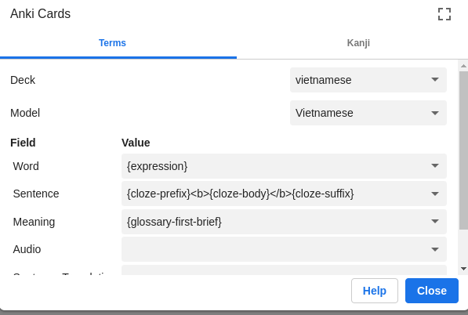
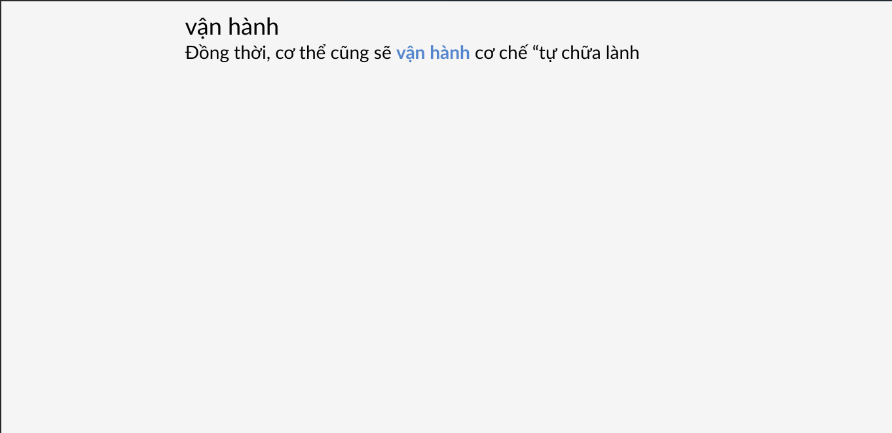
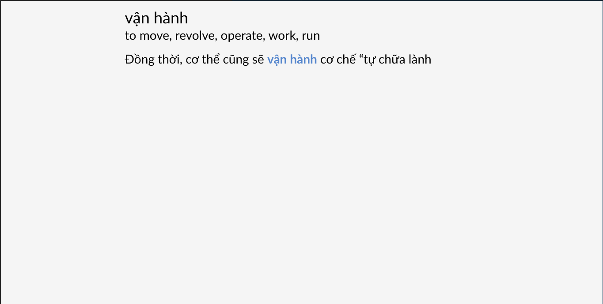

## Set up Yomitan and Anki for mining

If you haven't set things up, please visit [here](yomitan.md) to set up Yomitan. 

To set up Anki integration, go to "Settings" > "Anki". Make sure "Enable Anki integration" is on, Anki is running and AnkiConnect is installed.

Scroll down and click "Configure Anki card format..." to select the Note Type for your mining deck.

The settings below are for the **Vietnamese** Note Type. You can install it by importing [this example deck](assets/vietnamese.apkg).

### Settings overview

| Field | Value |
| --- | --- |
| `Word` | `{expression}` |
| `Sentence` | `{cloze-prefix}<b>{cloze-body}</b>{cloze-suffix}` |
| `Meaning` | `{glossary-first-brief}` |

[Here is how to set up offline audio server.](https://learnjapanese.moe/yomichan/#bonus-adding-forvo-extra-audio-source)

### Screenshot

### Preview

## Read more about Mining
- [Donkuri's guide to mining](https://donkuri.github.io/learn-japanese/mining/)