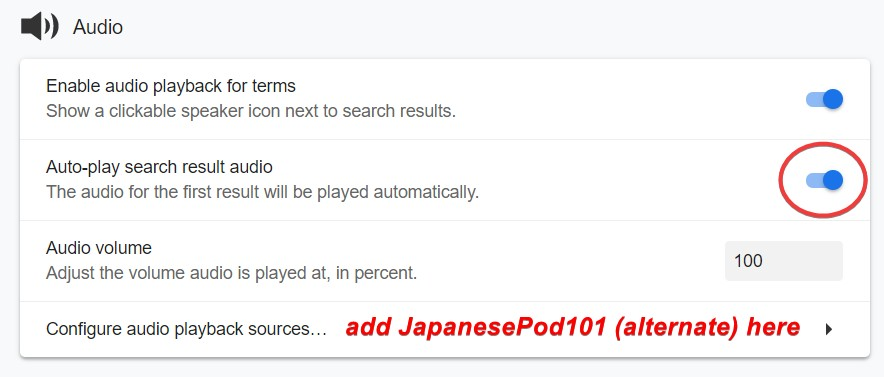

# Monolingual Guide  

!!! info "Intermediate Learners"
	This is a guide targeted at "intermediate" learners.

This guide will go through what the monolingual transition is and why you should do it, different mediums to access monolingual dictionaries and also ways to approach getting used to monolingual dictionaries. 
This guide is **long.** But it is still simple, it’s just the initial setup that just feels long.

### What is the monolingual transition

The monolingual transition is when you “transition" into getting used to a monolingual dictionary, often with the help of a bilingual dictionary as an aid. A monolingual dictionary is a dictionary that defines words of the language in that language. For example, the Oxford Dictionary is a monolingual English dictionary. "Lạc Việt" is a monolingual Vietnamese dictionary.

### Why you should use a monolingual dictionary
Monolingual dictionaries help you avoid making false associations with words from your native language (probably English) to Vietnamese. You may think, oh, what if I’m not even English? If you don’t use a monolingual dictionary, then you will make false associations anyway, no matter what your native language is. What if I’m English and I use the "" (Vietnamese-German bilingual dictionary)? Same thing. You will still have this problem. There is no language that can express Vietnamese better than Vietnamese itself.

### What exactly do you mean by “false associations”?
Bilingual definitions, 90% of the time are very vague, and do not capture the true feeling of the word. You may not think so, but I’ve been using monolingual dictionaries for a long time now and I can confirm bilingual definitions do not capture the true feel of the word.

Here’s an example: 
> Thống khổ 

If you have been learning Vietnamese for a few months, you would know this word. And chances are you learned it using a bilingual dictionary. Let’s look at the bilingual definition.

> unhappy, miserable  

You may think, “what’s wrong with it?” I’ll tell you what’s wrong with it. It’s so vague to the point that it is literally wrong. Now let’s look at the monolingual definition.

*Taken from the Từ điển Tiếng Việt thông dụng*

> Đau đớn và khổ sở đến cực độ

My translation of the definition:

> Feel painful and extremely miserable

*And this gets less accurate when you put it into English.*

Did you get that from unhappy, miserable”? No. Probably not.

Not convinced? Let’s go through another example.

> Xấu

Let me ask you one thing. What do you think this word means? If you answered, “bad”. Then you’re only half wrong. This word is not equal to the English word “bad”.

You can't use **xấu** to say that your skill at something is inferior/poor, like you can in English. You use a completely different word in Vietnamese, and that’s **kém** (or **tồi**, **dở**). See? And this is only scratching the surface of this problem.

The other reason why you should use monolingual definitions is because they help you think in Vietnamese. Like I said before, there is no language that can express Vietnamese as well as Vietnamese itself can. Dictionary definitions are a way of thinking about words. I’m sure dictionary authors (who are native speakers) put thought into each of their definitions when they wrote their definition, so by reading the definition and memorising it, you will have something *at least close* to what a native speaker may think of the word. If you learn words using a Vietnamese-English bilingual dictionary then you will have a "dị" way of thinking about things, and not even close to what a native may think about the word. This will set you back in getting a true understanding of the word. Don’t get me wrong, you can still get a true understanding with immersion, it just takes a lot longer than if you learned those words monolingually.

Monolingual dictionaries are very powerful, and you will only realise this once they become second nature to you.

### Why people find it hard to go monolingual.

Two reasons:  

- They don’t know the words.  
- Are not used to the written Vietnamese.

### Monolingual transition myths

- A profound belief that "dictionary vocabulary" exist. 
  
**The truth:** “Dictionary vocabulary” = words you don’t know because you don’t read enough.

## Yomichan - the better way to go monolingual.  

**I recommend doing the monolingual transition with Yomichan.**  

Yomichan is a browser extension that allows you to look up Vietnamese words on a webpage by holding ++shift++ and hovering over it. It is supported by any Chromium or Firefox based browser. You can find out how to set up Yomichan [here](yomitan.md)  

### Optimizing Yomichan Settings 

First you need to ensure that Advanced options is enabled.  

Second, we want to remove any and all scan delays because we will be making heavy use of this extension and wouldn't want to be slowed down by anything.  

Now we will enable scanning within pop-ups, this is very important, as we want to be able to look up any words we don't know within a **definiton.**  
  

You may want to increase the size of your Yomichan pop up window because by default it is pretty small and will become a hindrance when using monolingual dictionaries. To make enough headroom to use Yomichan dictionaries comfortably we are going to edit the following settings.  

  

Here's how our pop up looks now:  
 

Next, if you want, you don't need to but I recommend it, enable automatic audio playback, so we know how to pronounce a word correctly the moment we look it up. Also add the extra audio source because surprisingly it adds extra audio!  

You can also add the Forvo audio source in Yomichan. See [Yomichan Setup Tutorial](yomitan.md) for more info.  

  

I will touch on dictionaries in the next section.  

### Getting and using monolingual dictionaries

Again, I recommend you use monolingual dictionaries with Yomichan. I will talk about alternatives later.
 
Before we continue, have a read on recommended dictionaries and what they are exactly. 

### Recommended Dictionaries
There aren't many monolingual dictionaries out there, so here are just some suggestions:

- **Từ điển Tiếng Việt thông dụng**
- [**Từ điển Tiếng Việt - Hồ Ngọc Đức**](https://www.informatik.uni-leipzig.de/~duc/Dict/install.html)
- [**Lạc Việt**](https://tratu.coviet.vn/hoc-tieng-anh/tu-dien/lac-viet/V-V/)
- [VNEDICT](http://www.denisowski.org/Vietnamese/vnedict_readme.htm) - Or other Vietnamese - English Dictionaries (Babylon, Hồ Ngọc Đức, Lạc Việt).

[Download Vietnamese dictionaries for Yomitan here](https://onlyduyy.github.io/viet-yomitan/)

### Continuation: Getting and using monolingual dictionaries  

Let's continue. 

Import the set of dictionaries that best suits you in [Recommended Dictionaries](#recommended-dictionaries).  

  

### Why do you say use a lot of dictionaries?

You need to have a lot of dictionaries and have every one of them enabled because there will always be some words that are in some dictionaries and not in others. We want to use monolingual dictionaries as much as possible here. Another reason is that different dictionaries will describe a word in a different way, and in many cases you may not understand one dictionary's definition, but understand another.  

!!! question "But you would have to do a lot of scrolling to get to the next word?" 
	You should use the keyboard shortcut ++alt+down++  

## Alternatives

### Online Dictionaries

- [Lạc Việt](https://tratu.coviet.vn/hoc-tieng-anh/tu-dien/lac-viet/V-V)  

### Yomichan Offline
You can still use Yomichan offline. Here’s how.

That’s how.

## Approaching Monolingual Dictionaries

There’s a few ways to approach getting used to monolingual dictionaries. I’ll go through each one of them.

Primarily in the AJATT community, there’s this one piece of advice:

### The “Throw away the bilingual dictionary forever, and start using the monolingual dictionary straight away!” Approach  

This is something Khatzumoto of AJATT proposed.  

I mean, if you read novels, this may be a pretty good approach, because you will already be familiar with the words, because novels generally just have more words than movies or comic. If you only watch movies and read comic, this may prove to be quite frustrating. When this piece of advice was put out, Yomichan didn’t exist. So people in that time would have found this piece of advice terrible and tiring to constantly look up everything in the definitions.  

This isn’t a fundamentally flawed approach, I think it’s pretty good how it says “just read the dictionary more!”, because that’s exactly what you need to do. 

I just disagree with throwing away the bilingual dictionary completely, because you still need it in the beginning of the monolingual transition. 

### What you SHOULD do

How did I learn how to be comfortable with monolingual dictionaries? I read more. (novels, books)  

When I read more novels I got more used to written Vietnamese, and when I looked up words, they were in monolingual, so when I learned more words, I got better at using the monolingual dictionary. Huh? Yeah. It’s really that simple. Read more. Read the novel more = reading the dictionary more because you need a dictionary to read novels.

### What did you do when you came across a word you didn’t know in the definition?

I looked it up with Yomichan. I tried reading the monolingual definition. If there were too many words I didn’t know in the definition, I just looked at the English definition (as a last resort) and moved on. You just need to keep doing this. REPETITION.   
Read more books. You will get comfortable with the monolingual dictionary if you just read a lot. Yes. Read more. Read a lot. That’s all there is to it.  Yomichan just makes the process easier, you don’t waste your energy manually searching, instead your energy goes into actually reading. That’s why I recommend using Yomichan.

### >Soo… what’s the best way to approach monolingual?

Read more novels with a monolingual dictionary. I recommend reading novels on [TVE-4U](https://tve-4u.org/forums/tu-sach-van-hoc-trong-nuoc.12/) using Yomichan.  

### What if I don't like reading novels? I hate reading novels!  

Find something you like. It can be a light novel (which has been translated into Vietnamese) or other things too you know. So even though you may despise novels in whatever your native language is, if you give it a shot (it will be difficult at first, as is everything), you may find yourself actually enjoying reading novels.  

### But wouldn’t I be reading the dictionary more than the actual novel?

So what? It’s good that you are reading the dictionary more. Think of the dictionary as something FUN. 
It's fascinating in its own right.  

  

#### 10 Important Tips and Tricks

(NHẤT). Read at least 1 novel before going monolingual.

(NHỊ). Try to experiment with what dictionary order is the best for you.

(TAM). If the word you look up with Yomichan is only in a bilingual dictionary, try searching it on Google.

(TỨ). If you don’t understand the definition even if you looked up all the words, just look at/use the bilingual definition (last resort). You will get better at understanding when you use it more.

(NGŨ). It is okay to check the bilingual definition to check that you’re getting the right basic idea.

(LỤC). Don’t worry about how much time it will take to “transition”

(THẤT). For monolingual Anki cards, just try to remember the gist of the definition. I tried to demonstrate this in [Vietnamese FAQ](faq.md)  

(BÁT). Try to look up words you already know, in the monolingual dictionary, this is just to try to get accustomed to the dictionary at first hand.

(CỬU). Forget looking up very concrete nouns such as animals in the monolingual dictionary, you are better off just using Google Images instead.

(THẬP). Don’t overdo yourself! If it's too hard, try to use the bilingual dictionary until you feel confident again!

Have fun immersing!

<h3>Found this useful? Consider supporting me (shoui - the original author) on Patreon!</h3>   

[Support me on Patreon](https://www.patreon.com/shoui)

