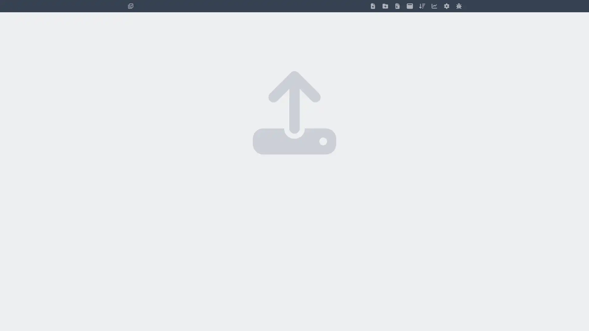
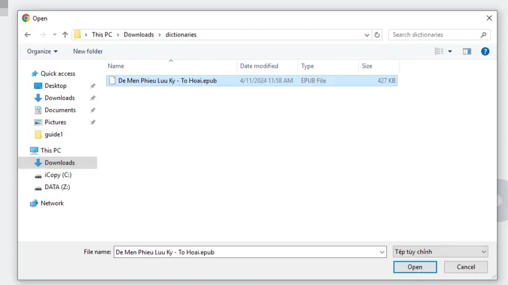
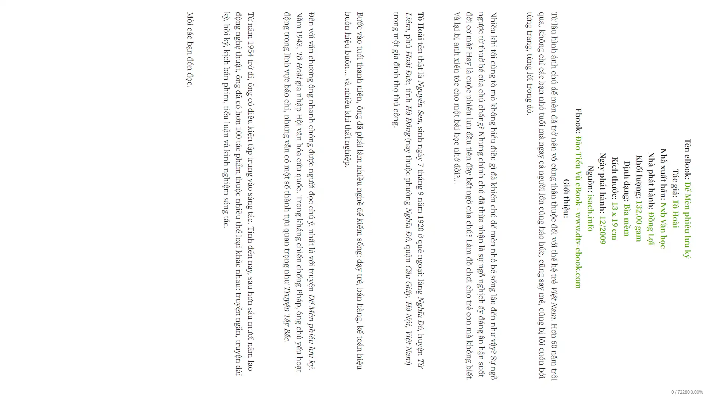
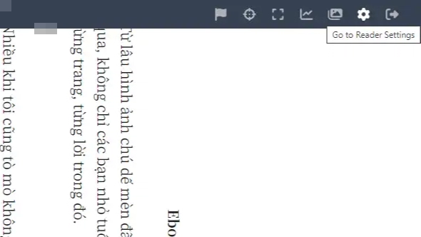
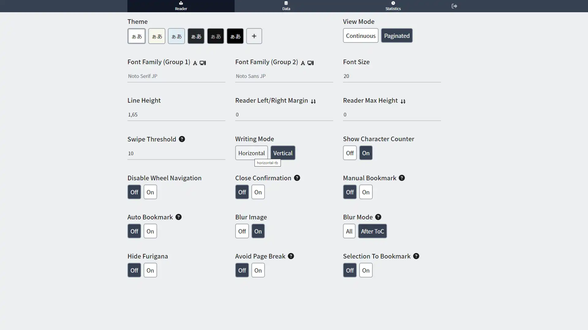

Guide to start reading Vietnamese books using `ttsu-reader` and `yomitan` to look up words directly.

First, please visit [ttsu-reader](https://reader.ttsu.app/) website. This website is originally created for reading Japanese books but we can also use it for reading any kinds of ebooks, Vietnamese e-books too!.

Here is how it looks like when you visit it the first time.

Click anywhere to add ebook file(s), or simply just drag-and-drop.

After importing the file, the book will be displayed on the dashboard, click on the book to read it. You will encounter this weird "error", it is in fact not an error, the text is automatically aligned vertically for Japanese ebooks.

Here is how you can
First, click on the upper-right corner of the screen, and then choose the "Gear" icon to visit "Settings Page".

Second, in the Settings page, on the "Writing Mode", change it to "Horizontal Mode" (It sets "Vertical Mode" by default for Japanese texts).

To return, click on the "Return" icon near the upper-right corner of the screen.

Here is the preview:

