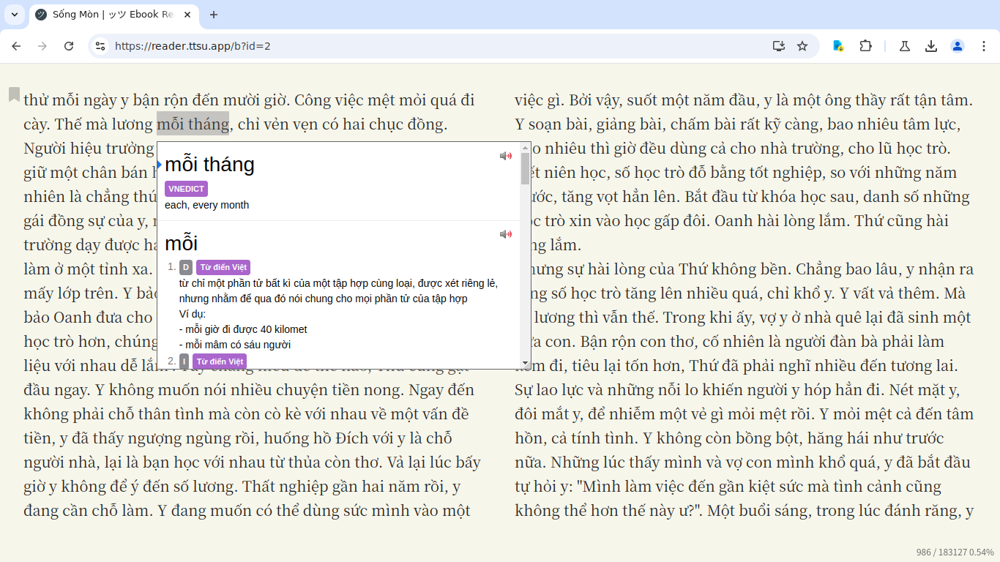

# Getting into Reading Vietnamese

Reading Vietnamese is ***CRUCIAL***. It is important you learn how to read Vietnamese. Often you get people asking "Well can I learn Vietnamese without learning how to read it?". You can, provided you don't want to understand basic grammar and have a tiny vocabulary size after years of study.  

With that said, it may seem difficult to learn how to read, after all there are like so much unique kanji on the page! Well yes, reading for the first time will always be painful, you just have to get through it and over time you will become more confident and better at reading. And if anyone is curious on how on earth you're supposed to find out how to read Vietnamese words and what they mean, just read on, there are certain tools that let you do this easily.  

Before you start reading for real, it is important you have already worked through a pre-made Anki deck, such as "1500 Từ vựng cơ bản" and also a grammar guide such as **Vietnamese - An Essential Grammar** or **seahorseviet**, this is to make the process less painful as there will be more words you know. Second, I recommend also having prior listening immersion experience because 1. it prevents you from developing a bad accent and 2. it helps you parse sentences better when reading.   

### Key Points  

1. Learning to read will always be painful in the start. You shouldn't wait "until you're ready" because you will never be ready until you start reading.  
2. It is not recommended you start reading without prior listening experience. I recommend that you have a feel of what the language sounds like before trying to reproduce the sounds yourself in your head (which is what you're doing when you are reading)
3. Don't worry about not comprehending a sentence no matter how many times you read it, in other words, learn to **tolerate ambiguity**. Things will become clearer as you read more. 
4. If you hate reading books in general, you can always play visual novels or read manga, both of which are very good for reading. 
6. Your first light novel/book whatever will always be the most painful. Get through it no matter how painful it is or how long is takes you. 
7. Don't rush yourself. Take your time. Go at your own pace. You wouldn't want to burnout and end up never reading again or anything.

## Learning how to read 

As mentioned earlier, make sure you have an adequate vocabulary size (say, you've finished a starter Anki deck) and a grasp of Vietnamese grammar before reading, this will make things much easier.

### Novels

Literary Vietnamese is not that hard as it sounds, it's only slightly different from spoken Vietnamese and will be easy to get used to.
For reading novels, I recommend using *Yomitan*, you can find a detailed Yomitan setup tutorial [here](yomitan.md)  

I seriously recommend you read novels on this site: [Tủ sách văn học trong nước](https://tve-4u.org/forums/tu-sach-van-hoc-trong-nuoc.12/). You can also visit the [this forum](https://tve-4u.org/) to download ebooks.

Your first light novel will be extremely painful, but your second light novel won't be as painful. Expect a light novel to take a 1-3 months to finish reading when you're first starting out, it will get quicker overtime (I can finish a light novel in around 10 hours). Just read more, read a lot.  
Reading scans or physicals like these is not recommended, because it is hard to look up words from it. 

*Novel: Tôi thấy hoa vàng trên cỏ xanh*

*Novel: Những ngày thơ ấu*

*Novel: Cho tôi xin một vé về tuổi thơ.*  

You need to read stuff like this:

*Novel: Sống mòn.*  

This is **digital**. Very important. I can select the text and use Yomitan with it.

## Conclusion
You can start reading after you have enough listening experience, and have finished a grammar guide or something. That's all. Don't hesitate. Don't feel like you're "not ready yet" because you will never be if you don't start reading.
Read more, read a lot, that's how you get good at reading.  No hacks, no tricks, sorry.

Have fun immersing! :smile:

