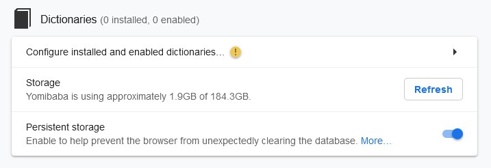
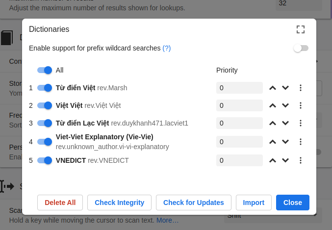

# Vietnamese Learning Setup

This section is about setting up the various tools we will use to learn Vietnamese, the most important of which are Anki and Yomitan. This section is divided in two subsections: *Anki* and *Yomitan*.

> Parts of this guide are extracted from [Japanese Learning Setup](https://donkuri.github.io/learn-japanese/setup) written by donkuri. I've updated quite a bit.

## Anki
The first tool we are going to set up is Anki. But first, what exactly is Anki?

### What is Anki?
Anki is a program which makes remembering things easy. Because it's a lot more efficient than traditional study methods, you can either greatly decrease your time spent studying, or greatly increase the amount you learn.

### Installing Anki
To install Anki, head to the [Anki homepage](https://apps.ankiweb.net/) and click on the blue download button.

### Installing basic add-ons

#### [AnkiConnect](https://ankiweb.net/shared/info/2055492159)

This is by far the most important add-on for mining. It allows one to use Yomitan to create cards automatically.

#### [Pass/Fail](https://ankiweb.net/shared/info/876946123)

It removes the "Hard" and "Easy" buttons entirely, which is more of a matter of taste. Personally, I use it.

#### [Progress Graphs](https://ankiweb.net/shared/info/266436365)

Adds cool progress graphs to help you understand your Anki usage better.

#### [Review Heatmap](https://ankiweb.net/shared/info/1771074083)

Review Heatmap lets you see your progress on the main page of Anki by showing you what days you did Anki and how many reviews you did.

### Enabling FSRS

FSRS is an alternative to the SM-2 algorithm for scheduling in Anki. I highly, highly suggest you use it. To do this, provided you are on Anki 23.10 or higher, you simply need to open the deck options and scroll down to Advanced section. There, enable FSRS. I highly suggest you read [this tutorial](https://github.com/open-spaced-repetition/fsrs4anki/blob/main/docs/tutorial.md) to get acquainted with the algorithm and see how it works.

## Yomitan

Now that we have Anki set up, it is time to focus on the second crucial tool we will use to learn Vietnamese: [Yomitan](https://github.com/themoeway/yomitan).

### Installing Yomitan
To install Yomitan, visit [yomitan.wiki](https://yomitan.wiki/). Please read the [Getting started guide](https://yomitan.wiki/getting-started/) to see how Yomitan works.

### Adding Dictionaries

Yomitan requires third-party dictionaries to function. To install the dictionaries, go to `Dictionaries > Configure installed and enabled dictionaries... > Import`.

Importing dictionaries in Yomitan

To acquire Vietnamese dictionaries for Yomitan, please visit [this page](https://thu-tram.github.io/viet-yomitan/).

The dictionaries will take a bit of time to import, it is normal. *Install dictionaries in the order given here.*

##### [VNEDICT](http://www.denisowski.org/Vietnamese/vnedict_readme.htm)
A Vietnamese-English dictionary made by Paul Denisowski.

##### Lạc Việt (Vietnamese-English)
One of my favorite billingual Vietnamese-English dictionary

##### Từ điển Tiếng Việt thông dụng
Contains 42012 entries.

##### [Từ điển Tiếng Việt - Hồ Ngọc Đức](https://www.informatik.uni-leipzig.de/~duc/Dict/install.html)
Pretty old

##### [Lạc Việt - Từ điển đơn ngữ Tiếng Việt](https://tratu.coviet.vn/hoc-tieng-anh/tu-dien/lac-viet/V-V/)
a Vietnamese monolingual dictionary

[Download Vietnamese dictionaries for Yomitan here](https://thu-tram.github.io/viet-yomitan/)

### Configuring Yomitan

I suggest you take some time to read the startup usage guide and see how Yomitan works for yourself. After this, you can disable it showing up every time you open your browser by ticking off `Show usage guide on startup` in the Yomitan settings menu (press on the cog wheel) under `General`. Here are a few more options you can take a look at if you would like to.

### Scanning

Here you can decide to use `Allow scanning popup content` or not. It lets you scan words in the definitions of your dictionaries which is useful when you're reading monolingual dictionaries in Vietnamese. If you enable it, you might want to change the number in `Maximum number of child popups` to something higher, like 3-5.
