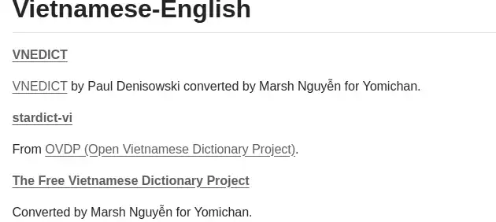
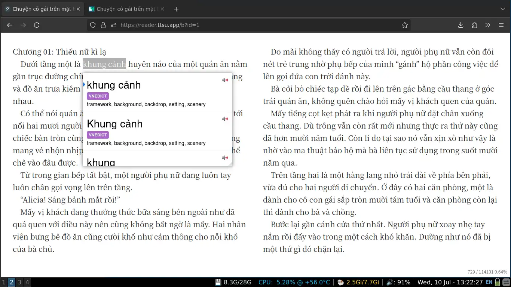

## Anki

You might wanna "learn" Anki beforehand. Here are some suggested full-text guides. If you prefer interactive guide, just look it up on Youtube.

- [Quick Guide](https://learnjapanese.moe/routine/#stage-learning-kanji-and-new-words-using-anki-for-the-first-time)
- [Comprehensive Guide from LearnAnki](https://leananki.com/how-to-use-anki-tutorial/)

## Yomitan

First, please visit [this page](https://github.com/MarvNC/yomichan-dictionaries?tab=readme-ov-file#vietnamese-english) to download Vietnamese - English Dictionary (VNEDICT) Yomitan dictionary.

Choose **VNEDICT** and it will redirect to the download page. There are 5 dictionaries, you can just download all of them if you have no idea which one should you use.

Read Yomitan installation guide [here](https://learnjapanese.moe/yomichan/) before proceeding.

### Preview:

## Asbplayer

Here is the guide for mining using Asbplayer: [YouTube & Netflix mining guide](https://soyuz18.notion.site/Sentence-mining-from-Netflix-and-YouTube-with-asbplayer-83a03590cd8349ba81ca10340645b565)
