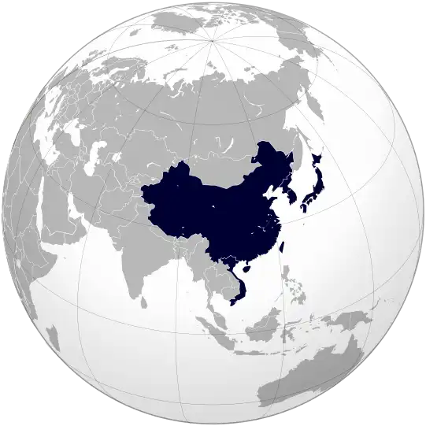
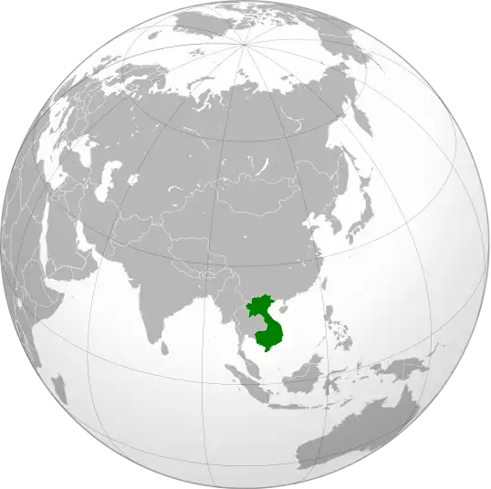
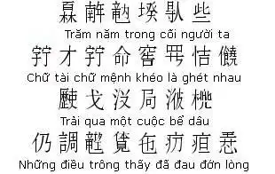
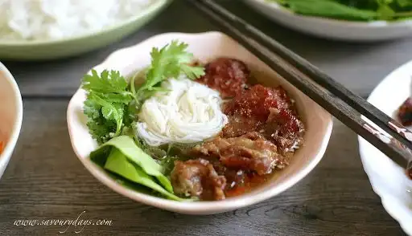
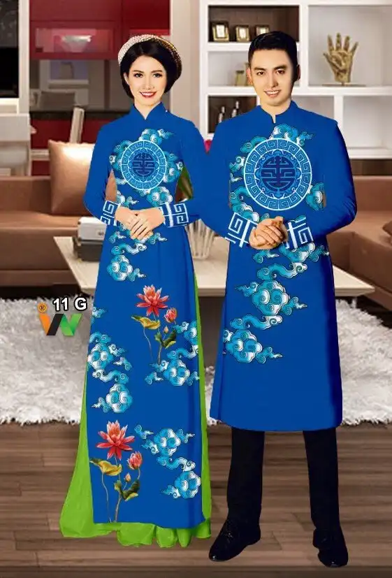
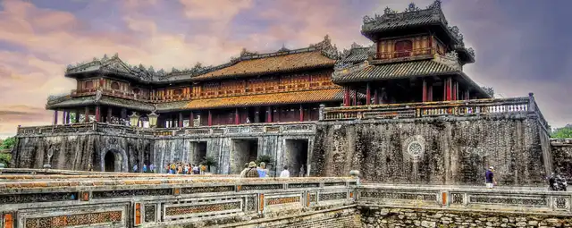
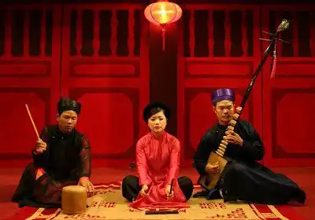
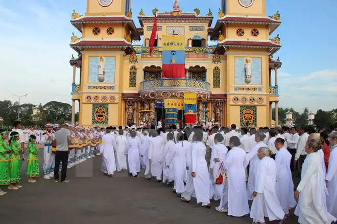

Vietnam is actually East Asian by culture & ethnicity. It's 1 of the main cultures within the [East Asian cultural sphere](https://en.wikipedia.org/wiki/East_Asian_cultural_sphere), and even [Harvard](https://ealc.fas.harvard.edu/vietnamese) labels Vietnamese as East Asian. Also, Vietnamese used to be written in [Chinese characters](https://en.wikipedia.org/wiki/Ch%E1%BB%AF_N%C3%B4m) before the French came and changed everything, and our ancestors came from South China & North Vietnam

Compare to other East Asian cultures (China, Japan, Korea), You can say that Vietnamese are somewhat more genuine and open to other cultures. Us Vietnamese live among a lots of culture and they (for whom I have seen) mostly do not regard toward races and genders much. Vietnamese are also (again, for the people I have seen) hard working and trying to figure their way around a lot. A lot of poor, underprivileged Vietnamese find happiness in themselves. And they would help people in need whenever their condition allows it.

This maybe bright and optimistic since this is what I see through my lens. Maybe I am a lucky person to have been able to engage with such people. But it never hurts too badly if you have faith and belief in people.

[How would you describe the Vietnamese culture?](https://qr.vern.cc/How-would-you-describe-the-Vietnamese-culture)

Initially, I would like to say that this question is very interesting. **_In terms of influence_**, generally, the Vietnamese culture is mainly influenced by two other cultures: **the Chinese** and **the Western**.

Because of geography, the Vietnamese culture is influenced by the Chinese one very, very remarkably. I could assert that the Chinese characteristics in it are more intensive than in Korean or Japanese cultures. Vietnam had been controlled by the Chinese monarchs in more than one thousand years. And even though Vietnam became independent from the 10th century, Vietnamese still realized the strong Chinese influence in their lives. Thus, it is unsurprising when Vietnam is considered as a part of the **East Asian cultural sphere** or the **Sinitic culture**.

However, from the 19th century, Vietnam began receiving Western cultural influences when the French armies took invasions of Vietnam. When **Vietnam** was completely a **French colony**, Western culture started an influx into Vietnam, mainly the **French one**. This influx was such strong that many Chinese signs were erased. Then, in the Vietnam War, by the appearance of Americans, Vietnam received **American cultural impacts**. And up to today, in globalization, Vietnamese culture is impacted by many cultures, including the Western one.

(Vietnam was a part of the French Indochina)

In addition to that, due to globalization, Vietnam is under the cultural effects of Korea (through the Hallyu movement) and Japan (through anime, manga, and more) as well as the other countries.

**_In terms of characteristics_**, overall, because Vietnam is traditionally an **agricultural** nation, the Vietnamese culture demonstrates the cultural points. Furthermore, it has many other essential clues.

_Language_: Vietnamese is a member of the **Vietic**, the branch of the **Austroasiatic language**, intelligible to the Mường language. In history, Vietnamese people used **Chinese characters** to write their mother tongue. Then, from the 13th century, they invented “**Chữ Nôm**” to be independent linguistically. Both Chinese characters and “Chữ Nôm” were used until the 20th century as they were replaced by the “**Quốc Ngữ**”. (The image below is a “Chữ Nôm” script of one of the most famous Vietnamese literature works “Truyện Kiều”, or “The Story of Kiều”)

_Cuisine_: Vietnam is very rich in terms of cuisine. That is because the climate of this country supports the development of a multitude of animals and plants. Additionally. Vietnam has been the intersection of numerous cultures in the world. As a result, Vietnamese cuisine is very different. Some typical Vietnamese aliments are rice, “phở”, “bánh mì” and “bún chả” (I hope someday you will visit Vietnam to eat them. They are delicious!). And unlike Westerners and like East Asians, Vietnamese use **chopsticks** in meals. (The image below is “bún chả”).

_Costume_: In history, Vietnamese costumes were strongly influenced by the Chinese ones. Thereafter, in Westernization, Vietnamese began wearing like Westerners. However, Vietnam has distinct clothes, representatively “áo dài”. Vietnamese women become more beautiful when they wear it. (The image below is the traditional clothes for both Vietnamese men and women).

_Architecture_: When Vietnam was a monarchial nation, Vietnamese architecture was impacted by China. Still, unlike Chinese old architectural products, the Vietnamese ones were more **moderate**. This point could be also found in the majority of Vietnamese modern buildings, which are constructed in Western-style. (The image below is in Huế, the former capital of Vietnam in the Nguyễn dynasty).

_Literature_: It could be said that Vietnamese like writing poems and stories very, very much. In the monarchial period, poets and story writers were mainly officers. They wrote those products just for entertainment. As for structure, they used the **Chinese** structure. However, in the “**lục bát”** poetry, they created a different structure (the first sentence includes six words, the second includes eight words). As for style, they were influenced remarkably by Chinese. As for topics, they were **Chinese history** (surprising, right?) and **regular life** as well as the **personal mind**. In the modern period, Vietnamese generally erase many Chinese clues to receive new ones from **the West**. Literature topics are richer than the past

_Music_: Although not achieving successes like Western music, in history, Vietnamese music was very vibrant. Like other cultural aspects, this music illustrated Chinese influence. it descended **pentatonic** mind. Another essential point is royal music and common music was different. **Royal music** preferred **dancing or performing without words**, where **common music** preferred **singing**. The main topics were Chinese history and regular life In this period, Vietnamese music brings Western and Korean clues. Topics are more abundant than in past but focused on principally love. Some of the Vietnamese typical musical kinds are “tuồng”, “chèo”, “cải lương”, “ca trù”, “nhã nhạc”. (The image below is a “ca trù” performance).

_Lifestyle_: Vietnamese prefer living in a community or a group to living in isolation.

_Belief_: Vietnamese believe there is **another world for the dead people**. Hence, in each Vietnamese home, there is an area or a room to obey and communicate with their **ancestors**. They also believe in the power of **Ông Trời**, as the Christians believe in Jesus Christ. Thus, the Vietnamese sentence “**Ôi trời ơi!**” is similar to “Oh my God” in English. Additionally, plenty of Vietnamese also believe in ideologies of some religions like Buddhism and Christianity. (The image below is an altar, obeying the ancestors of a Vietnamese family).

_Religion_: The majority of Vietnamese **don’t follow any religion**. For the rest, according to the latest religious statistics, **Vietnamese Christians are the most**, followed by Vietnamese Buddhists. Vietnamese also created new regions like **Cao Đài** or new religious branches like **Hòa Hảo Buddhism**. (The image below is a meeting of the Cao Đài followers).

Those are some characteristics of Vietnamese culture.