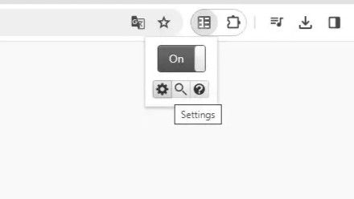
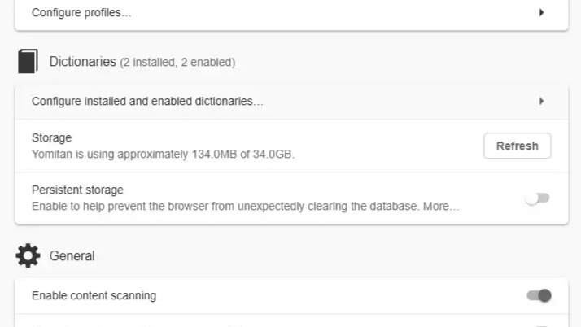
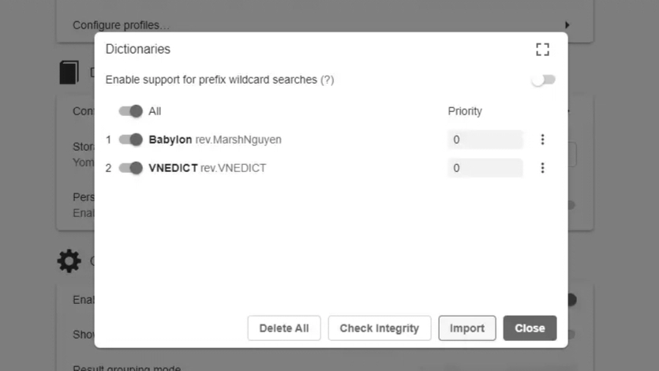
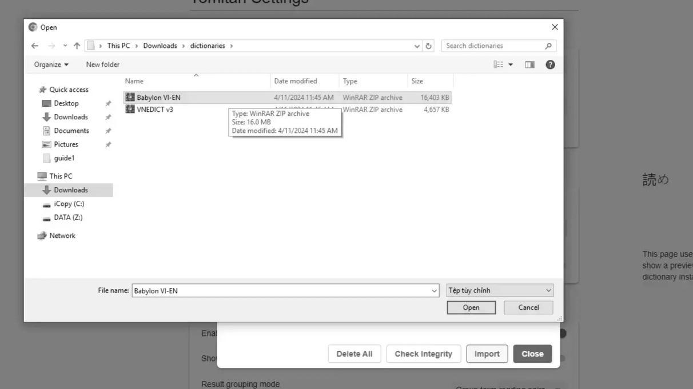

First, please visit [this page](https://github.com/MarvNC/yomichan-dictionaries?tab=readme-ov-file#vietnamese-english) to download Vietnamese - English Dictionary (VNEDICT) Yomitan dictionary.

Choose **VNEDICT** and it will redirect to the download page. There are 5 dictionaries, you can just download all of them if you have no idea which one should you use.

First, open Yomitan Settings.

Second, choose "Configure installed and enabled dictionary".

Third, choose "Import" to import installed dictionaries

Then choose the Babylon (Which I installed earlier), or your installed dictionaries and import it to Yomitan.

Preview:

