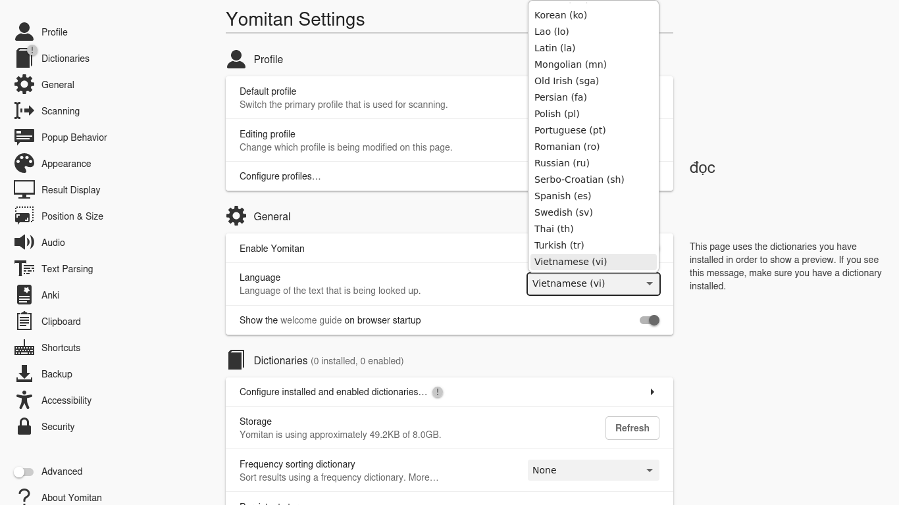
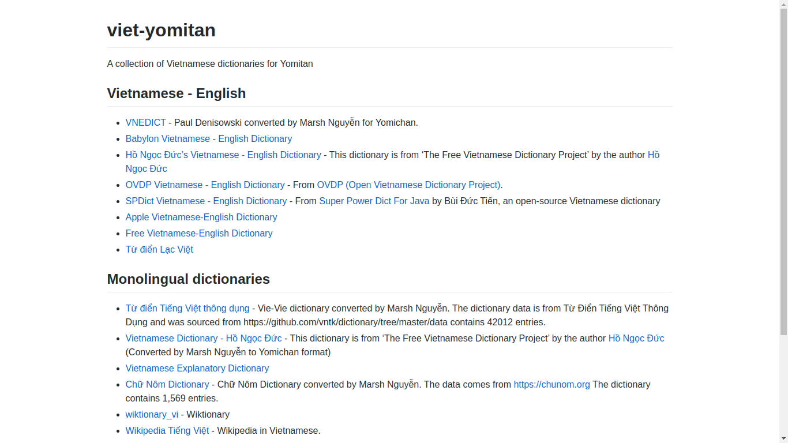
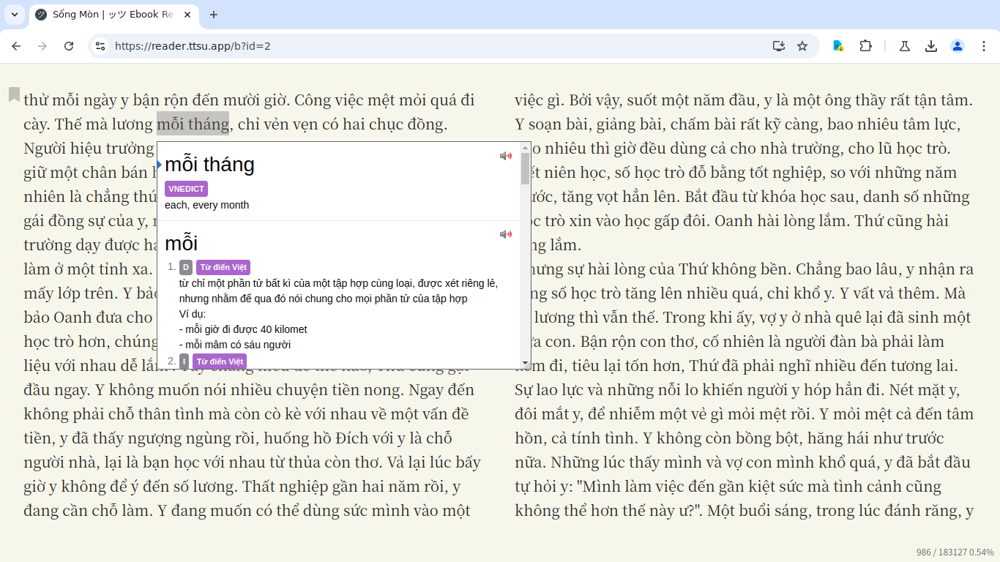

# Yomitan Setup Tutorial

## What is Yomitan?
Yomitan is a browser extension that allows you to look up Vietnamese words with both the meaning and the reading on web pages with ease.  

## Getting Started 
Yomitan is available for both Chromium and Firefox based browsers. You can find the respective versions below.

[Chrome Web Store](https://chromewebstore.google.com/detail/yomitan/likgccmbimhjbgkjambclfkhldnlhbnn)  

[Firefox](https://addons.mozilla.org/en-GB/firefox/addon/yomitan/)  

[Yomitan Wiki](https://yomitan.wiki/)

Once installed, it will open a new tab page. Remember to change the language to Vietnamese as shown here then close it.

## Acquiring Dictionaries

When you first install Yomitan, you need to load dictionaries into it in order to use it.  
These files use the `.zip` extension and **are not to be extracted by the user.**

You can find my collection of Yomitan dictionaries below. This will have everything you need and (probably) don't need. :slight_smile: 

[duykhanh471's Yomitan Dictionary Collection](https://thu-tram.github.io/viet-yomitan/).

I recommend you install the following dictionaries:  

- VNEDICT
- Từ Điển Lạc Việt
- Từ điển Tiếng Việt thông dụng
- Từ điển Tiếng Việt - Hồ Ngọc Đức
- Từ điển Lạc Việt đơn ngữ

## Installing dictionaries and basic usage
  
1. Click on the  icon in the browser toolbar.  
2. Click on the  icon to access the settings page.  
3. On the left sidebar, click on "Dictionaries" and then click on "Configure installed and enabled dictionaries…"  
4. Click the "Import" button on the bottom.  
5. Here's where you select the dictionaries to import. Please only import the following. 
6. Please wait for the dictionaries to import. This could take a while.
7. Once complete, you can test Yomitan by holding down the ++shift++ key and hovering over Vietnamese text. Here is a sample: Tiếng Việt. It will display a pop up box displaying the definitions separated by dictionary.  

Click anywhere outside of the box or press the ++esc++ key to dismiss.

You can click the  button to hear the word being pronounced by a native speaker.

In your browser extensions toolbar, if you click on the Yomitan logo, then on the  icon or by using the ++alt+insert++ keyboard shortcut, you can access Yomitan Search, this is where you can use Yomitan as a standalone Vietnamese to English dictionary. 

Pop up box size can be edited with advanced settings enabled.  

A full dark mode can be enabled in the settings too.  

## Recommended frequency dictionaries  

Yomitan supports the use of frequency dictionaries that tell you how common a word is.

**What is a common word?**  

Very common: 1-10,000  
Commmon: 10,001-20,000    
Fairly common: 20,001-30,000   
Kind of uncommon: 30,001-40,000  
Uncommon: 40,001-50,000  
Rare: 50,001-80,000  
Natives-probably-don't-know-it-level: 80,000+  

## Allowing access to file URLs

Enabling this allows you to use Yomitan on local files such as .HTML files.  

!!! failure "PDF Files"
    On Chrome, you need to use [PDF.js](https://mozilla.github.io/pdf.js/web/viewer.html). Click on the diagonal up arrow thingy to load a pdf.  

Chromium:  
	- Right click the   
	- Click "Manage Extensions"  
	- Enable "Allow access to file URLs"  

Firefox:  
	- Enabled by default.  

## Bonus: Adding Forvo extra audio source  

You may encounter missing audio with the default Yomitan audio sources, adding [Forvo](https://vi.forvo.com/) will help fill in the gaps.  

Thanks to [jamesnicholas](https://github.com/jamesnicolas/yomichan-forvo-server) for this wonderful add-on!

This requires you to have Anki (2.1 and newer) installed and open on your computer to work.  

1. Copy this code `580654285`
2. In Anki, in the menu at the top, click on **Tools**, then **Add-ons**.
3. In the new window, click **Get Add-ons...** and paste the code `580654285` into the text box and click **OK**
4. Restart Anki by closing it and opening it back up again.
5. In the Yomitan settings page , click **Audio** on the left, and then click on **Configure audio playback sources...**
6. Click **Add** and then select **Custom** from the drop down menu. 
7. Now where it says **Custom audio source (?)**, select the type **JSON** from the drop down menu.
8. In the URL text box, enter this `http://localhost:8770/?expression={expression}&reading={reading}`

## Anki Setup

See [kuri's website](https://donkuri.github.io/learn-japanese/setup/#anki-setup).

## Offline audio server (+ More audios than default)  

[Follow this guide to get local audio.](https://github.com/themoeway/local-audio-yomichan)  
