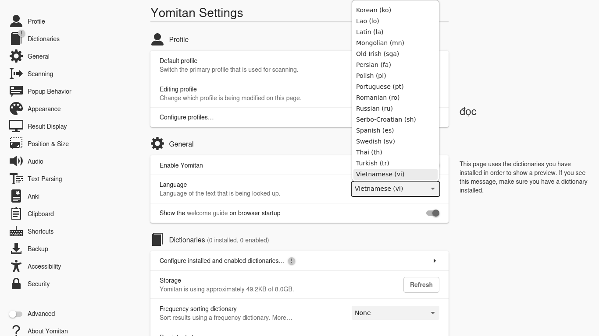

## Getting Started
Read Yomitan installation guide [here](https://learnjapanese.moe/yomichan/#getting-started/) before proceeding.

PS: Remember to change the language to Vietnamese as shown here.

## Acquire Dictionaries

Please visit [this page](https://github.com/MarvNC/yomichan-dictionaries?tab=readme-ov-file#vietnamese-english) to download Vietnamese - English Dictionary Collection.

Or you can visit [my collection page](https://github.com/onlyduyy/viet-yomitan) for more dictionaries.

## Installing dictionaries and basic usage
Visit [Installing dictionaries and basic usage](https://learnjapanese.moe/yomichan/#installing-dictionaries-and-basic-usage) from the original Yomitan installation guide to learn how to install dictionaries in Yomitan and then import these dictionaries (here are just my suggestions):

### Billingual

- [VNEDICT v4.zip](https://www.mediafire.com/file/2uouyurvtqph6nk/VNEDICT_v4.zip/file)
- [Babylon VI-EN v2.zip](https://www.mediafire.com/file/14cljd9ta8k2r7d/Babylon_VI-EN_v2.zip/file)
- [ODVN VI-EN v2.zip](https://www.mediafire.com/file/xwpqadhb8hsjoqa/%255BOVDP%255D_VI-EN_v2.zip/file)
- [Vietnamese - English Dictionary - Apple](https://drive.proton.me/urls/XZRWCKDM54#Bnq28tvMixEm) - Optional.

### Monolingual
- [Từ điển Tiếng Việt](https://www.mediafire.com/file/ekopqoj0627tpkw/T%25E1%25BB%25AB_%25C4%2591i%25E1%25BB%2583n_ti%25E1%25BA%25BFng_Vi%25E1%25BB%2587t.zip/file)
- [VI-VI Dict - Hồ Ngọc Đức](https://www.mediafire.com/file/zkr1i29t7d6vxth/%255BVI_-_VI%255D_dict.zip/file)

## Preview:

